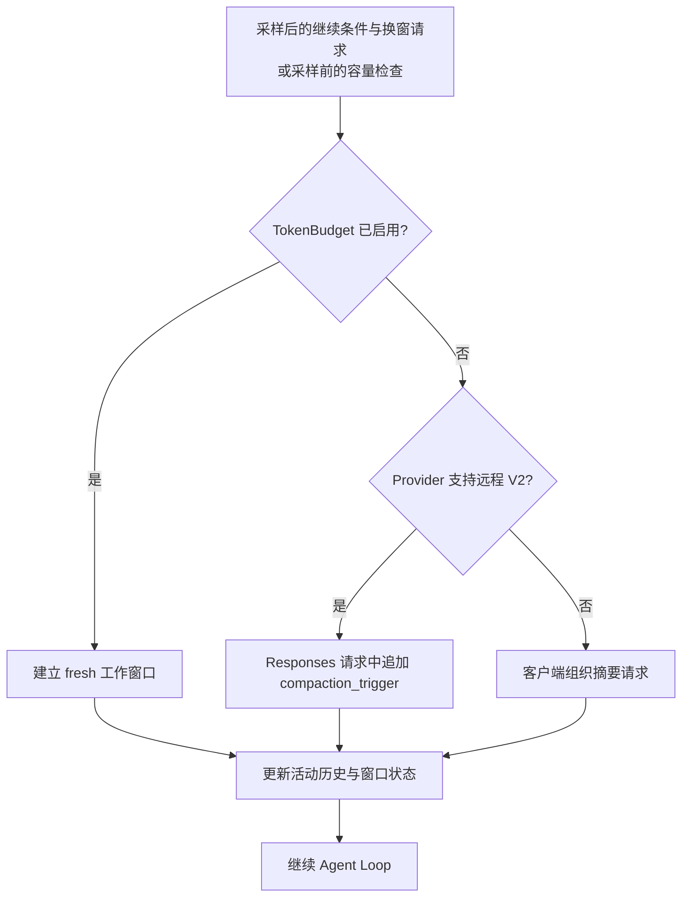
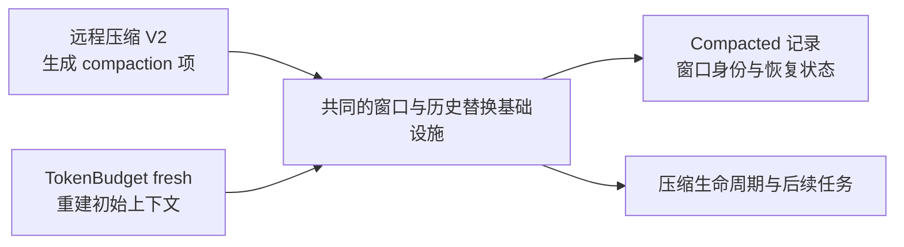
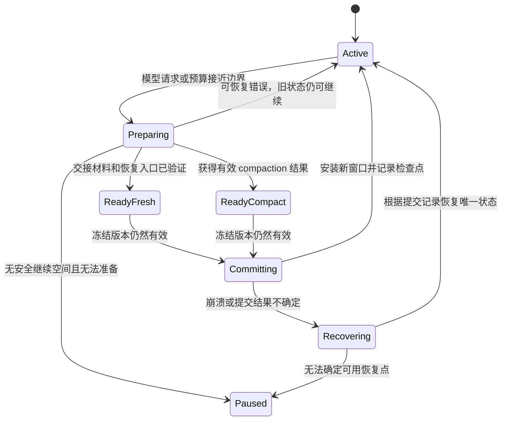

# Codex 会告别 Compact 吗？从远程压缩、new_context 到可回查的工作记忆

> 源码基线：[OpenAI Codex `516f2780fd227a80cd9fe89488f5039245090b71`](https://github.com/openai/codex/tree/516f2780fd227a80cd9fe89488f5039245090b71)，提交时间 2026-09-13 16:14:41 UTC；2026-09-14 核对的上游 `main` 快照。本文分析公开客户端源码，不代表已安装客户端的版本或所有账户的线上配置。配套材料：[逐函数源码解析](source-analysis.md)、[引用清单](source-map.json)、[离线校验脚本](verify_sources.py)。

假设一个持续数小时的编码任务，累计产生了 100 万 token 的调查记录，而当前工作窗口是 272,000 token。无论把摘要做得多好，模型都不可能在每一轮同时看到全部原文。系统必须决定：哪些内容继续留在窗口里，哪些内容暂时移出去，以及移出去之后怎样找回来。

这里的 100 万是说明问题的假设，不是运行基准；272,000 则来自本次源码快照中 Astra 的内置 `context_window`。同一项配置还写着更大的 `max_context_window`，但客户端的 `resolved_context_window()` 优先使用前者，不能拿最大值代替本次实际解析出的窗口。线上模型目录和用户配置还可能改变这些值。[内置 Astra 模型与 TokenBudget 提示配置](https://github.com/openai/codex/blob/516f2780fd227a80cd9fe89488f5039245090b71/codex-rs/models-manager/models.json#L1-L112)；[模型容量与自动压缩阈值](https://github.com/openai/codex/blob/516f2780fd227a80cd9fe89488f5039245090b71/codex-rs/protocol/src/openai_models.rs#L509-L533)。

过去，人们常把这个问题简化为“窗口快满了，生成一段摘要，然后继续”。最新 Codex 已经出现另一条完整路径：模型维护笔记，需要时主动调用 `new_context`，客户端重新建立工作窗口，再通过历史工具恢复细节。

这很容易被概括成“Compact 被取消了”。但把执行路径追到底，我得到的结论更具体：**远程压缩仍在；实验模式把部分原本由摘要承担的连续性，交给了笔记和按需回查。两条路径已经共享窗口切换的生命周期，却还没有共享一个能自主选择策略的决策层。**

本文先解释今天已经运行在公开代码里的机制，再讨论未来怎样融合。后半部分的接口和状态机是设计建议，不是对未公开产品计划的披露。

目录：

- [1. 先拆开四个经常混用的概念](#section-1)
- [2. 一轮任务怎样走到窗口切换](#section-2)
- [3. 远程压缩仍然存在，只是走进了 Responses 流](#section-3)
- [4. new_context 怎样建立一个新工作窗口](#section-4)
- [5. history、notes 和本地 memories 分别保存什么](#section-5)
- [6. 提醒、缓冲区与强制切换怎样配合](#section-6)
- [7. 为什么换窗可能更清爽，却不一定更便宜](#section-7)
- [8. 两条路径已经融合到了哪里](#section-8)
- [9. 如果继续融合，应该设计成什么样](#section-9)
- [10. 用故障场景检验这个设计](#section-10)
- [11. 怎样从日志、请求和测试验证判断](#section-11)
- [12. 源码索引与参考资料](#section-12)

<a id="section-1"></a>
## 1. 先拆开四个经常混用的概念

讨论 Compact 是否消失，首先需要确认消失的究竟是一个 URL、一种算法、一条客户端分支，还是一个界面事件。

| 名称 | 触发方与执行方式 | 换窗后主要依赖什么 | 不能据此推出什么 |
|---|---|---|---|
| Codex 远程压缩 V2 | 客户端构造带 `compaction_trigger` 的请求，服务端返回压缩项 | 保留的消息、服务端压缩项，以及重新注入的初始上下文 | 不能推导为普通推理请求已自动完成压缩 |
| 公共 Responses API 的服务端自动压缩 | 应用设置 `context_management`，服务端按配置阈值执行 | API 返回的压缩上下文 | 不能推导为 Codex 当前正使用这组参数触发压缩 |
| Codex TokenBudget / `new_context` | 模型请求或预算条件触发，客户端建立 fresh 窗口 | 初始上下文、可选保留消息、notes 提示及后续 history 回查 | 不能推导为旧会话被自动总结或工作环境被清空 |
| `ContextCompaction` 生命周期 | 客户端统一报告开始、结束，并运行相应 hooks | 取决于实际执行的策略 | 不能仅凭事件名判断是否调用了远程模型 |

前两项都可能被口头叫作 server-side compaction，但触发链路不同。公共 API 文档描述了 `context_management` 下的 `type: "compaction"` 和阈值配置，同时仍保留独立压缩接口的说明。Codex 当前 V2 则由客户端主动追加 `CompactionTrigger`。这两件事需要分别核对。[官方 Compaction 指南](https://developers.openai.com/api/docs/guides/compaction)；[CompactionTrigger 请求构建](https://github.com/openai/codex/blob/516f2780fd227a80cd9fe89488f5039245090b71/codex-rs/core/src/compact_remote_v2_attempt.rs#L69-L91)。

还有一条名为 local compaction 的分支。这里的 local 指客户端组织摘要提示和历史处理，不是本地离线模型。它仍然需要模型生成摘要；不能把“没有调用专用压缩接口”解释成“没有网络请求”。[手动压缩的策略分支](https://github.com/openai/codex/blob/516f2780fd227a80cd9fe89488f5039245090b71/codex-rs/core/src/tasks/compact.rs#L35-L66)；[客户端摘要路径仍调用模型流](https://github.com/openai/codex/blob/516f2780fd227a80cd9fe89488f5039245090b71/codex-rs/core/src/compact.rs#L755-L780)。

真正值得研究的变化，是谁决定保留什么、谁负责恢复细节，而不只是路径名里有没有 `compact`。

<a id="section-2"></a>
## 2. 一轮任务怎样走到窗口切换

**当前位置：模型完成一次采样及工具执行，Agent Loop 准备决定是否继续。**

在 `session/turn.rs` 中，客户端会收集两个状态：是否还有后续工作，以及上下文预算是否到达边界。后续工作既可能来自模型还需要继续，也可能来自待处理的输入。

真正的切换条件很短：

```rust
// codex-rs/core/src/session/turn.rs:600-609
                let should_roll_over = needs_follow_up
                    && (sess.take_new_context_window_request().await || token_limit_reached);
                let allow_auto_compact_fallback = !should_roll_over && !token_limit_reached;
                super::token_budget::maybe_record(
                    sess.as_ref(),
                    turn_context.as_ref(),
                    token_status.base_window_tokens_remaining,
                    allow_auto_compact_fallback,
                )
                .await;
```

[循环边界上的切换判断](https://github.com/openai/codex/blob/516f2780fd227a80cd9fe89488f5039245090b71/codex-rs/core/src/session/turn.rs#L600-L609)。

这段判断表达了两个容易被忽略的事实。第一，模型调用 `new_context` 后，客户端在循环边界处理请求；工具执行器并不直接重写整段历史。第二，这段采样后的逻辑要求 `needs_follow_up`，不能脱离这个条件概括成“每次结束都立即换窗”。代码还存在采样前的容量检查，所以整套系统也不只靠这一处判断。[采样之后的完整控制流](https://github.com/openai/codex/blob/516f2780fd227a80cd9fe89488f5039245090b71/codex-rs/core/src/session/turn.rs#L550-L640)；[采样前的容量检查](https://github.com/openai/codex/blob/516f2780fd227a80cd9fe89488f5039245090b71/codex-rs/core/src/session/turn.rs#L1231-L1275)。

当需要切换时，`run_auto_compact()` 按有效配置分派：



最关键的是分支优先级：

```rust
// codex-rs/core/src/session/turn.rs:1408-1417
    if turn_context.config.features.enabled(Feature::TokenBudget) {
        // Compaction is the reset request, so force a new context window
        // instead of consuming a pending `new_context` tool request.
        crate::compact_token_budget::run_inline_auto_compact_task(
            Arc::clone(sess),
            step_context,
            initial_context_injection,
        )
        .await?;
        return Ok(());
```

[TokenBudget 优先分支](https://github.com/openai/codex/blob/516f2780fd227a80cd9fe89488f5039245090b71/codex-rs/core/src/session/turn.rs#L1408-L1417)。

**TokenBudget 开启时，无论换窗请求来自模型还是预算限制，这个自动分派入口都会先走 fresh 路径。**它不是“模型主动时 fresh，窗口撑满时再 remote compact”的混合策略。后面的远程分支只有在前面的模式没有接管时才会进入。[自动切换的策略分支](https://github.com/openai/codex/blob/516f2780fd227a80cd9fe89488f5039245090b71/codex-rs/core/src/session/turn.rs#L1408-L1452)。

手动 `/compact` 也有相同的优先关系：先判断 TokenBudget，再判断 provider 的远程压缩能力。这意味着同一个命令，在不同有效配置下可以产生不同的内部行为。[手动压缩的策略分支](https://github.com/openai/codex/blob/516f2780fd227a80cd9fe89488f5039245090b71/codex-rs/core/src/tasks/compact.rs#L35-L66)。

用户看到的统一操作名，已经不足以描述系统究竟怎样管理工作记忆。

<a id="section-3"></a>
## 3. 远程压缩仍然存在，只是走进了 Responses 流

**当前位置：TokenBudget 没有接管，客户端进入远程 V2 分支。**

远程压缩先从活动历史建立请求输入，在发送前处理工具输出和相关元数据，再追加一个协议项：

```rust
// codex-rs/core/src/compact_remote_v2_attempt.rs:69-91
    let (mut input, prompt_input_metadata): (Vec<_>, Vec<_>) = history
        .for_prompt_annotated(&turn_context.model_info().input_modalities)
        .into_iter()
        .map(|envelope| (envelope.item, envelope.metadata))
        .unzip();
    sess.services
        .executed_tool_calls
        .strip_disabled_direct_metadata(&mut input);
    let tool_router = &step_context.tool_router;
    input.push(ResponseItem::CompactionTrigger {});
    let prompt = Prompt {
        input,
        tools: tool_router.model_visible_specs(),
        parallel_tool_calls: true,
        base_instructions,
        output_schema: None,
        output_schema_strict: true,
        cyber_access_program: turn_context.cyber_access_program,
    };

    let mut responses_metadata = sess
        .compaction_responses_metadata(turn_context.as_ref(), compaction_metadata)
        .await;
```

[CompactionTrigger 请求构建](https://github.com/openai/codex/blob/516f2780fd227a80cd9fe89488f5039245090b71/codex-rs/core/src/compact_remote_v2_attempt.rs#L69-L91)。

注意 `tools` 来自当前 step 的工具路由器，输入也不是凭空生成的一句“请总结”。它是一份为压缩准备的 Responses 请求，携带历史、基础指令和当前工具清单。

后续调用复用 `ModelClientSession::stream()`。HTTP 的 provider 相对路径是 `/responses`；实际完整 URL 由 provider 基地址决定，底层也可能走 WebSocket。不能因为客户端使用了共同的传输入口，就把它描述成没有独立请求或没有模型往返。[压缩复用 Responses 流式客户端](https://github.com/openai/codex/blob/516f2780fd227a80cd9fe89488f5039245090b71/codex-rs/core/src/compact_remote_v2.rs#L364-L417)；[Responses 的 provider 相对路径](https://github.com/openai/codex/blob/516f2780fd227a80cd9fe89488f5039245090b71/codex-rs/codex-api/src/endpoint/responses.rs#L38-L47)。

逻辑上的请求形状可以写成下面这样。它是便于阅读的归一化示意，省略了真实客户端的元数据、认证、工具定义和传输编码，并非抓包原文：

```json
{
  "model": "<当前压缩所用模型>",
  "input": [
    "<为压缩准备的历史项>",
    {"type": "compaction_trigger"}
  ],
  "stream": true
}
```

服务端流回来之后，客户端并不是找到任意一段文本就开始换窗。`collect_compaction_output()` 等待完成事件，并要求收到恰好一个 `ResponseItem::Compaction`：

```rust
// codex-rs/core/src/compact_remote_v2.rs:461-472
    let Some(response_id) = completed_response_id else {
        return Err(CodexErr::Stream(
            "remote compaction v2 stream closed before response.completed".to_string(),
        ));
    };

    if compaction_count != 1 {
        return Err(CodexErr::Fatal(format!(
            "remote compaction v2 expected exactly one compaction output item, got {compaction_count} from {output_item_count} output items"
        )));
    }

```

[完成事件与 compaction 数量检查](https://github.com/openai/codex/blob/516f2780fd227a80cd9fe89488f5039245090b71/codex-rs/core/src/compact_remote_v2.rs#L461-L472)。

“恰好一个”约束的是 compaction 类型项的数量，不是整个响应只能包含一个输出项。没有 `response.completed`、没有 compaction 项，或者收到多个 compaction 项，都不能当成成功结果安装。[响应收集和完整性校验](https://github.com/openai/codex/blob/516f2780fd227a80cd9fe89488f5039245090b71/codex-rs/core/src/compact_remote_v2.rs#L419-L481)。

成功之后，客户端会从请求历史中筛选允许继续保留的消息，将这些消息限制在相应预算内，再加入服务端返回的压缩项。这里存在 64,000 token 的保留消息预算，以及单独的图片处理；它不是“把全部旧历史再原样附一遍”。真实用户消息、部分 hook 提示、符合条件的 agent 消息，以及开关允许的客户端 developer 消息分别有保留规则。普通工具输出不会因此全部原文保留。[保留消息和压缩项的组合](https://github.com/openai/codex/blob/516f2780fd227a80cd9fe89488f5039245090b71/codex-rs/core/src/compact_remote_v2.rs#L483-L509)；[哪些原始消息可以留下](https://github.com/openai/codex/blob/516f2780fd227a80cd9fe89488f5039245090b71/codex-rs/core/src/compact_remote_v2.rs#L534-L578)。

接下来推进窗口编号和 ID，按调用场景处理初始上下文注入，再通过公共历史替换函数安装结果、记录检查点、重新计算 usage，最后发出完成事件。[压缩结果安装顺序](https://github.com/openai/codex/blob/516f2780fd227a80cd9fe89488f5039245090b71/codex-rs/core/src/compact_remote_v2.rs#L297-L355)。

这条链路同时回答了两个问题：远程压缩的确仍有实际调用入口；它也不是简单地返回一个人类可读摘要字符串。客户端处理的是专门的 compaction 协议项，公开客户端源码不足以解释服务端如何编码、训练或恢复其中的表示。

<a id="section-4"></a>
## 4. new_context 怎样建立一个新工作窗口

**当前位置：模型在 TokenBudget 模式下，主动请求结束当前工作窗口。**

工具的当前定义没有策略参数：

```rust
// codex-rs/core/src/tools/handlers/new_context_window_spec.rs:6-17
pub(crate) const NEW_CONTEXT_WINDOW_TOOL_NAME: &str = "new_context";

pub fn create_new_context_window_tool() -> ToolSpec {
    ToolSpec::Function(ResponsesApiTool {
        name: NEW_CONTEXT_WINDOW_TOOL_NAME.to_string(),
        description: "Start a new context window. Does not clear, reset, or otherwise affect environment state.".to_string(),
        strict: false,
        defer_loading: None,
        parameters: JsonSchema::object(BTreeMap::new(), /*required*/ None, Some(false.into())),
        output_schema: None,
    })
}
```

[new_context 工具定义](https://github.com/openai/codex/blob/516f2780fd227a80cd9fe89488f5039245090b71/codex-rs/core/src/tools/handlers/new_context_window_spec.rs#L6-L17)。

它没有 `reason`，没有 `preferred_strategy`，也没有 `preserve_summary`。执行器调用 `request_new_context_window()`，返回的语义是“将开始一个不总结会话历史的新窗口”。底层只是设置一个布尔标记，由循环后续消费。[new_context 工具执行器](https://github.com/openai/codex/blob/516f2780fd227a80cd9fe89488f5039245090b71/codex-rs/core/src/tools/handlers/new_context_window.rs#L13-L43)；[窗口请求标记的写入与消费](https://github.com/openai/codex/blob/516f2780fd227a80cd9fe89488f5039245090b71/codex-rs/core/src/state/auto_compact_window.rs#L95-L103)。

这也划定了模型当前获得的控制权：**模型可以请求何时换窗，但不能通过这个工具选择 fresh 或 remote。**公开注册路径中也没有一个与之对称的 `remote_compact` 模型工具。[上下文工具的注册条件](https://github.com/openai/codex/blob/516f2780fd227a80cd9fe89488f5039245090b71/codex-rs/core/src/tools/spec_plan.rs#L1203-L1215)。

真正执行切换的是 `compact_token_budget.rs`。源码注释明确说，它跳过模型和服务端的总结，仍使用正常的压缩生命周期：

```rust
// codex-rs/core/src/compact_token_budget.rs:19-23
/// Runs token-budget manual compaction as a normal compaction lifecycle.
///
/// Token-budget compaction skips model/server summarization and installs a fresh context window
/// instead. It is still modeled as compaction so compact hooks and `ContextCompaction` turn items
/// observe the same lifecycle as local or remote compaction.
```

[fresh 路径的源码契约](https://github.com/openai/codex/blob/516f2780fd227a80cd9fe89488f5039245090b71/codex-rs/core/src/compact_token_budget.rs#L19-L23)。

客户端依次运行 pre-compact hooks、发出开始事件、调用 `start_new_context_window()`、发出结束事件，再运行 post-compact hooks。hooks 可以影响流程，但这条实现本身不生成交接摘要。[fresh 路径的生命周期](https://github.com/openai/codex/blob/516f2780fd227a80cd9fe89488f5039245090b71/codex-rs/core/src/compact_token_budget.rs#L63-L81)。

`start_new_context_window()` 做的是一组具体的状态操作：

1. 如果启用了保留客户端 developer 消息的功能，从历史中筛出这些消息并限制保留量。
2. 推进窗口状态：原 current 变成 previous，创建新的 current ID，窗口编号加一，并重置本窗口的提醒标记。
3. 基于当前 step 和 world state 重建初始上下文，收集扩展贡献的窗口提示。
4. 用这份新上下文及可选保留消息替换活动历史；fresh 路径的 `compaction_response_id` 和压缩模型 hash 均为空。
5. 持久化相关检查点，并重新计算活动窗口的 token 用量。

这些步骤直接落在 [新窗口的构建与安装](https://github.com/openai/codex/blob/516f2780fd227a80cd9fe89488f5039245090b71/codex-rs/core/src/session/mod.rs#L4385-L4435) 和 [窗口 ID 和提醒状态推进](https://github.com/openai/codex/blob/516f2780fd227a80cd9fe89488f5039245090b71/codex-rs/core/src/state/auto_compact_window.rs#L77-L94)。

因此，“fresh”应理解为新的工作上下文，而不是空白进程。工具执行造成的文件修改、后台进程、当前工作环境和适用规则，不会因为调用这个工具而被撤销。新上下文还包含客户端重新生成的初始信息。更不能把换窗当成一次新的用户授权。

另一方面，旧用户请求、旧工具结果和旧推理过程也不是默认完整保留。任务连续性必须依靠重新提供的信息以及后续恢复。测试 `new_context_tool_skips_auto_compact_fallback` 就检查了换窗后请求不再携带特定旧内容，同时窗口身份发生变化。[new_context 跳过旧 fallback 的测试](https://github.com/openai/codex/blob/516f2780fd227a80cd9fe89488f5039245090b71/codex-rs/core/tests/suite/token_budget.rs#L1574-L1677)。

这条路径最实质的变化是：以前由压缩模型一次性完成的信息选择，现在有一部分提前交给工作中的模型，让它在推进任务时就整理下一窗口需要的状态。

<a id="section-5"></a>
## 5. history、notes 和本地 memories 分别保存什么

**当前位置：新窗口已经建立，模型需要重新找到任务线索。**

如果只能拿到一个新窗口，却没有恢复入口，持续任务就会变成每隔一段时间重新开工。Codex 为这条路径配套了 `history` 和 `notes` 扩展。

先纠正一个很自然的误解：当前原生扩展里的这两组工具，调用的是 Codex 后端。它们不等于在本机 `~/.codex` 目录中读写文件。客户端工具定义把名称映射到 `alpha/history/v2/*` 与 `alpha/notes/v2/*`，后端适配器构造认证 POST 请求。[history 和 notes 的工具到路由映射](https://github.com/openai/codex/blob/516f2780fd227a80cd9fe89488f5039245090b71/codex-rs/ext/history-notes/src/tools.rs#L70-L101)；[后端请求、截断策略和超时](https://github.com/openai/codex/blob/516f2780fd227a80cd9fe89488f5039245090b71/codex-rs/ext/history-notes/src/backend.rs#L14-L95)。

### 5.1 history 是回查入口，notes 是主动整理的交接材料

| 能力 | 当前工具 | 主要解决的问题 | 代价或信息损失 |
|---|---|---|---|
| 窗口目录 | `history.list_windows` | 找到可回查的窗口 | 目录不提供全部细节 |
| 历史目录 | `history.list_items` | 按窗口、角色和工具缩小范围 | 预览长度有限，仍可能需要下一次读取 |
| 历史读取 | `history.read_item` | 用窗口 ID 和 item ID 读取指定范围 | 消耗工具调用和新窗口预算 |
| 历史搜索 | `history.search_contents` | 不知道精确 ID 时定位内容 | 当前契约是区分大小写的字面子串搜索，不是语义检索 |
| 笔记目录与读取 | `notes.list_files_by_prefix`、`notes.read_file` | 找到已整理的工作状态 | 笔记遗漏的内容不会自动补齐 |
| 笔记搜索 | `notes.search_contents` | 在笔记中定位关键词 | 同样受搜索词和一致性约束 |
| 笔记写入 | `notes.append_to_file`、`notes.write_file` | 增量维护状态或重写交接材料 | 模型必须决定写什么，并确认工具结果 |

接口定义见 [历史和笔记工具的参数契约](https://github.com/openai/codex/blob/516f2780fd227a80cd9fe89488f5039245090b71/codex-rs/ext/history-notes/src/tools.rs#L141-L241)。

可以把 notes 看成模型编写的“接手指南”，把 history 看成指南引用的证据库入口。前者适合保存当前目标、已证实的结论、未解决的问题和关键 item ID；后者用于恢复某次工具输出或用户要求的具体措辞。

例如，一个理想交接条目可以写成下面这样。内容是人为构造的写作示例，不是读取任何真实会话笔记：

```text
当前目标：确认请求重试是否保留服务端返回的状态字段。
已确认：HTTP 路径会更新该字段，证据见 <window_id>/<item_id>。
尚未确认：WebSocket 重连后的第二次请求。
下一步：检查重连测试的第二份请求，再判断是否需要改实现。
约束：用户只授权分析，目前不要修改或发布。
```

只写“正在研究请求重试”太短，会迫使下一窗口重新调查；复制整段工具日志又把归档层重新塞回工作窗口。好的 notes 应保留决策状态和定位线索，而不追求复刻整段会话。

### 5.2 新窗口不会自动灌入所有笔记

原生扩展在构建窗口上下文时请求 `alpha/notes/v2/thread_hint`，把后端返回的提示放进 `PromptSlot::ContextWindow`。客户端把这个提示限制在 **4,000 字节**，不是 4,000 token。[窗口提示的后端读取与注入](https://github.com/openai/codex/blob/516f2780fd227a80cd9fe89488f5039245090b71/codex-rs/ext/history-notes/src/extension.rs#L97-L151)。

这更像恢复入口或简短导引，不能理解成“所有笔记每次都会注入”。返回文本缺失、请求失败或超出限制时，该贡献器返回空片段；这里没有自动改成读取本地笔记文件的分支。

后续怎样读取，主要由模型指导语和工具调用完成。内置 TokenBudget 指导语要求模型增量保存笔记、保留窗口和 item 的引用，在新窗口中根据需要恢复细节。由此能推出设计意图，却不能推出每次执行都已经写好笔记、每条引用都可读。[内置 Astra 模型与 TokenBudget 提示配置](https://github.com/openai/codex/blob/516f2780fd227a80cd9fe89488f5039245090b71/codex-rs/models-manager/models.json#L1-L112)。

### 5.3 笔记的“文件”是虚拟路径

notes 的工具契约明确把路径定义为虚拟路径。相对路径在当前 agent 的 notes 名字空间下解释，不能拿它直接执行 `cat`、`rg` 或文件系统备份。该契约还声明单文件上限为 **1,000,000 UTF-8 字节**，成功写入后的直接读取应立即可见，而列表和搜索可能延迟数秒。history 同样声明最终一致性。[历史和笔记的命名空间契约](https://github.com/openai/codex/blob/516f2780fd227a80cd9fe89488f5039245090b71/codex-rs/ext/history-notes/src/tools.rs#L20-L27)。

这些是公开客户端携带的接口契约。它们不证明后端采用了哪一种数据库、对象存储或同步实现，也不保证全部历史内容都能无损回放。

请求中会补充 `session_id` 和 `current_agent_name`。部分操作带加密参数标识；如果响应包含 `encrypted_output`，客户端封装为加密内容项继续送给模型。这里能确认的是协议边界，不能据此推导出完整的端到端加密方案。[后端请求注入会话与 agent 身份](https://github.com/openai/codex/blob/516f2780fd227a80cd9fe89488f5039245090b71/codex-rs/ext/history-notes/src/backend.rs#L38-L55)；[加密工具结果的客户端封装](https://github.com/openai/codex/blob/516f2780fd227a80cd9fe89488f5039245090b71/codex-rs/ext/history-notes/src/tools.rs#L332-L350)。

### 5.4 本地 rollout 和长期 memories 是另外两层

| 层次 | 公开客户端中的入口 | 生命周期与用途 | 与当前换窗的关系 |
|---|---|---|---|
| 活动上下文 | core 的 history / window 状态 | 当前推理请求需要的内容 | 每次换窗重建或替换 |
| 后端 history / notes | `ext/history-notes` | 当前 rollout 内的细节回查与交接 | fresh 模式的重要恢复支撑 |
| 本地 rollout 记录 | `rollout/src/recorder.rs` | 会话持久化、恢复和相关事件记录 | 可以记录压缩检查点，但不会自动全部重新进入 prompt |
| 本地长期 memories | `ext/memories` 与 `memories/write` | 跨任务积累的可复用经验 | 与 TokenBudget 的 notes 分属不同实现 |

本地 memories 扩展确实使用 `LocalMemoriesBackend`；记忆写入模块也确实存在启动任务与分阶段处理。它们都不能作为“每次 `new_context` 前一定会自动写交接笔记”的证据。[独立的本地 memories 扩展](https://github.com/openai/codex/blob/516f2780fd227a80cd9fe89488f5039245090b71/codex-rs/ext/memories/src/extension.rs#L136-L172)；[本地记忆写入的启动任务](https://github.com/openai/codex/blob/516f2780fd227a80cd9fe89488f5039245090b71/codex-rs/memories/write/src/start.rs#L24-L94)。

本地 rollout 是另一条持久化链路。恢复模型上下文时，代码会考虑压缩后的 replacement history 等记录，而不是简单读取整个 JSONL 再发给模型。持久化策略和加密项也意味着“磁盘有记录”不等于“磁盘上有每一字节的可读原文”。[本地 rollout 记录器](https://github.com/openai/codex/blob/516f2780fd227a80cd9fe89488f5039245090b71/codex-rs/rollout/src/recorder.rs#L1-L95)；[本地 rollout 持久化筛选](https://github.com/openai/codex/blob/516f2780fd227a80cd9fe89488f5039245090b71/codex-rs/rollout/src/policy.rs#L1-L67)；[从 rollout 重建活动模型上下文](https://github.com/openai/codex/blob/516f2780fd227a80cd9fe89488f5039245090b71/codex-rs/rollout/src/model_context.rs#L1-L130)。

<a id="section-6"></a>
## 6. 提醒、缓冲区与强制切换怎样配合

**当前位置：模型仍在旧窗口工作，需要决定什么时候写笔记、什么时候调用 `new_context`。**

源码中的 `maybe_record()` 很容易让人误以为它会自动记录笔记。沿着调用看下去，实际记录的是上下文提醒：接近阈值时加入预算提示，基础预算耗尽且条件允许时加入 fallback 指导语。它没有执行 `notes.write_file`。[预算提醒与 fallback 提示的注入](https://github.com/openai/codex/blob/516f2780fd227a80cd9fe89488f5039245090b71/codex-rs/core/src/session/token_budget.rs#L161-L224)。

内置配置中的指导语要求模型持续更新笔记，所以用户可能观察到它时不时写一些东西。但这是提示驱动的模型行为，加上阈值触发的提醒；不是客户端每隔若干秒强制定时写笔记。

预算计算也有两层边界：一层是自动切换范围，另一层是模型完整可用上下文。范围可以计入全部活动上下文，也可以只计入初始前缀之后的增长量。后者并不能解除完整上下文限制。[两种计量范围与容量边界](https://github.com/openai/codex/blob/516f2780fd227a80cd9fe89488f5039245090b71/codex-rs/core/src/session/context_window.rs#L60-L109)。

用简化符号表达源码逻辑：

```text
U = 全部活动上下文用量
S = 自动切换范围内的用量：U，或扣除初始前缀后的增长量
A = 自动切换的基础阈值
C = 模型完整可用上下文上限
B = 配置有效 fallback 提示时的缓冲区

向模型报告的基础剩余量 = max(0, min(A - S, C - U))
强制切换条件 = S >= A + B，或者 U >= C
```

这里为了展示关系，假设两个阈值都有值；源码还处理阈值未知的情况。缓冲区只有在相应 fallback 提示存在时才会计入。[剩余预算和缓冲区计算](https://github.com/openai/codex/blob/516f2780fd227a80cd9fe89488f5039245090b71/codex-rs/core/src/session/context_window.rs#L82-L109)。

以本次内置 Astra 元数据为例，假设采用 `Total` 计量、没有阈值和窗口覆盖，并采用默认有效比例及该模型的 TokenBudget 提示配置，可以算出：

| 项目 | 推导值 | 含义 |
|---|---:|---|
| resolved context | 272,000 | 优先取 `context_window` |
| 基础自动阈值 A | 244,800 | 272,000 × 90% |
| 完整可用上限 C | 258,400 | 272,000 × 默认 95% |
| 笔记提醒阈值 | 剩余 6,144 | 模型配置中的提醒门槛 |
| 配置缓冲区 B | 16,384 | 为 fallback 提示之后的动作预留 |
| A 到 C 的实际空间 | 13,600 | 小于配置缓冲区，先撞到完整上限 |

数据与计算依据：[内置 Astra 模型与 TokenBudget 提示配置](https://github.com/openai/codex/blob/516f2780fd227a80cd9fe89488f5039245090b71/codex-rs/models-manager/models.json#L1-L112)；[模型容量与自动压缩阈值](https://github.com/openai/codex/blob/516f2780fd227a80cd9fe89488f5039245090b71/codex-rs/protocol/src/openai_models.rs#L509-L533)；[有效上下文默认比例](https://github.com/openai/codex/blob/516f2780fd227a80cd9fe89488f5039245090b71/codex-rs/protocol/src/openai_models.rs#L389-L391)；[剩余预算和缓冲区计算](https://github.com/openai/codex/blob/516f2780fd227a80cd9fe89488f5039245090b71/codex-rs/core/src/session/context_window.rs#L82-L109)。

这个例子揭示了一点：**配置了 16,384 token 的缓冲区，不等于模型一定能使用这完整的一段空间。**工具输出可能一次跨过阈值，完整窗口上限也可能更早到达。客户端并没有因为模型还没写完笔记，就允许超出模型边界。

在 TokenBudget 模式下，到达强制切换条件后仍然走 fresh 分支。名字叫 `auto_compact_fallback_prompt` 的配置，是给模型的应急交接提示，不是“失败后自动调用远程压缩”的策略开关。相关测试分别覆盖使用缓冲区后主动换窗，以及耗尽缓冲区后由客户端推进窗口。[缓冲区与强制换窗测试](https://github.com/openai/codex/blob/516f2780fd227a80cd9fe89488f5039245090b71/codex-rs/core/tests/suite/token_budget.rs#L1411-L1570)。

因此，更可靠的运行方式必须把笔记维护分摊到任务过程中。最后一刻才开始整理全部状态，会把一次大工具输出、一次网络失败和一次容量耗尽叠加到同一时刻。

<a id="section-7"></a>
## 7. 为什么换窗可能更清爽，却不一定更便宜

把漫长的排查过程移出活动窗口，可以减少过时假设和重复日志对后续推理的干扰。这是 fresh 模式有吸引力的原因。但“清爽”不是“自动纠错”：错误结论如果被写进 notes，换窗后仍可能重新出现。

远程压缩和笔记恢复，实际是在不同位置支付连续性的成本。

| 策略 | 连续性主要由谁整理 | 优势 | 明确的损失与成本 |
|---|---|---|---|
| 远程压缩 | 压缩请求对应的服务端模型能力 | 直接从较完整的当前材料构造延续状态 | 额外压缩请求；压缩表示难由客户端审计；细节仍可能损失 |
| fresh + notes + history | 工作模型提前整理，后续模型按需恢复 | 当前窗口可围绕下一阶段重新组织；能定向回查证据 | 笔记写入与回读成本；遗漏和检索失败风险；依赖后端可用性 |
| 两者按阶段组合 | 工作模型提出意图，客户端约束策略 | 有机会按任务特点分配保留与回查 | 决策、验证、恢复和观测复杂度都上升 |

可以写出一个用于测量的成本分解，但不能用它直接宣称性能提升：

```text
远程切换成本 ≈ 压缩请求 + 安装新上下文 + 必要的补充回查
fresh 切换成本 ≈ 分摊的笔记写入 + 提示获取 + 笔记回读 + 历史回查 + 重新预填充
```

各项既有 token 成本，也有延迟；串行工具链和缓存命中率会影响结果。fresh 省去了该分支中的总结请求，却可能多出数次恢复请求。远程 V2 复用了 Responses 客户端，也并不消除服务端生成压缩结果的工作。

任务类型会改变取舍。如果接下来要精确修改刚刚分析过的协议转换器，一段尚未整理的细节可能非常关键；如果已经完成一个调查阶段，下一阶段主要是依据明确结论写文档，简短笔记和证据链接可能更适合。

要评价哪条路径更好，至少应该在相同任务上测量总延迟、总 token、恢复调用次数、事实遗失、重复调查和任务成功率。本文没有运行这类 A/B 实验，因此不提供“快几倍”“降低多少费用”之类没有证据的结论。

<a id="section-8"></a>
## 8. 两条路径已经融合到了哪里

当前实现已经有三个共同基础。

第一，远程压缩和 fresh 都会推进上下文窗口身份。`first_window_id`、`previous_window_id`、`window_id` 让系统能够描述同一任务内部的窗口关系。第二，它们都进入压缩相关生命周期，使 hooks 和界面能围绕一次窗口转换工作。第三，它们都能通过公共历史替换机制记录新的活动上下文与恢复检查点。[窗口 ID 和提醒状态推进](https://github.com/openai/codex/blob/516f2780fd227a80cd9fe89488f5039245090b71/codex-rs/core/src/state/auto_compact_window.rs#L77-L94)；[fresh 路径的生命周期](https://github.com/openai/codex/blob/516f2780fd227a80cd9fe89488f5039245090b71/codex-rs/core/src/compact_token_budget.rs#L63-L81)；[压缩结果安装顺序](https://github.com/openai/codex/blob/516f2780fd227a80cd9fe89488f5039245090b71/codex-rs/core/src/compact_remote_v2.rs#L297-L355)；[替换历史与持久化检查点](https://github.com/openai/codex/blob/516f2780fd227a80cd9fe89488f5039245090b71/codex-rs/core/src/session/mod.rs#L3929-L4005)。

这相当于两种执行策略共用了一部分基础设施，但调用它们的仍是配置分支。



可以据此推断：如果未来引入统一策略层，不必从头发明窗口编号、检查点和事件机制。但不能再跨一步，说代码中已经存在自适应融合。

当前没有证据表明模型能通过 `new_context` 请求远程压缩，也没有证据表明客户端会根据“推理是否受污染”“笔记质量是否足够”自动选择策略。`new_context` 的空参数 schema 和 TokenBudget 优先分支，恰好说明现在的边界还很明确。

因此，我认为“远程压缩能力不会因为 fresh 模式出现就失去价值”是有技术依据的判断；“某个旧 URL 永远不会移除”则没有同等依据。能力可以继续存在，端点、协议项和内部命名仍然可以演进。

<a id="section-9"></a>
## 9. 如果继续融合，应该设计成什么样

以下是基于现有代码提出的设计，不是当前已实现行为。

### 9.1 保留明确的 fresh 语义，再增加更通用的切换意图

我不建议悄悄把 `new_context` 改成“有时总结、有时不总结”。当前执行器已经明确承诺不总结会话历史；若模型为甩开旧推理而调用它，服务端又自动把旧推理压缩带回来，就改变了调用含义。

更合理的演进是保留这个明确语义，同时提供更通用的上下文转换请求，或提供明确的独立压缩能力。名称只是示意，关键是契约：

| 设计选项 | 模型表达的内容 | 优点 | 代价或损失 |
|---|---|---|---|
| 继续保持两种固定模式 | 只决定何时 fresh，远程由另一模式负责 | 实现和行为最容易理解 | 同一任务内难按阶段切换 |
| 增加明确的远程压缩工具 | 明确请求 fresh 或压缩 | 模型能直接选择；工具语义清晰 | 模型必须理解能力限制和成本 |
| 增加通用转换请求 | 表达目标、保留要求和允许的策略 | 客户端可依据能力、预算与恢复状态协商 | schema、策略规则和结果解释更复杂 |
| 在服务端完全隐式处理 | 主要由服务端阈值策略决定 | 应用侧操作较少 | 若缺乏协商，难表达主动丢弃旧推理等语义 |

我更看好明确工具与通用意图逐步并存：模型提供任务边界和需要保留的状态，客户端落实可执行的转换，服务端提供压缩能力。

下面的伪代码只用于解释这种分工，没有对应的当前 Codex 类型：

```text
提议中的 WindowTransitionRequest
  intent: fresh | preserve_continuity | automatic
  allowed_strategies: 明确允许使用的策略集合
  required_state: 目标、约束、待办、已确认副作用的引用
  recovery_refs: 已确认可读的笔记或历史引用
  budget: 最大交接量、最低预留空间

提议中的 WindowTransitionResult
  chosen_strategy
  old_window_id / new_window_id
  preserved_state_refs
  readiness: prepared | committed | failed
```

`intent` 不是让模型自行决定安全边界。是否有权访问某段历史、某个动作是否得到用户授权、能否删除恢复状态，仍应由已有的可信运行时规则控制。

### 9.2 把信息分成必须携带和可以回查的两类

一个只依赖自然语言摘要的交接，很难证明重要状态没有被漏掉。未来的融合可以在两条路径之外，共同要求一个小型交接清单。

| 信息 | 建议如何处理 | 原因 |
|---|---|---|
| 当前用户目标与后续修正 | 小型清单中保留正文或可靠引用 | 防止换窗后恢复成过时目标 |
| 已授权范围与适用规则 | 从可信运行时重建，必要时携带来源 | 模型笔记不能生成新的授权 |
| 已经发生的外部副作用 | 记录操作状态、结果引用和幂等键 | 防止重复提交或发布 |
| 当前待完成工作 | 结构化待办和阻塞原因 | 保留任务推进位置 |
| 大量工具日志和调查细节 | history 引用，按需读取 | 避免重新装满窗口 |
| 模型的暂时猜测 | 明确标注未验证，必要时不携带 | 减少旧假设继续主导下一阶段 |

这个清单不是又一份无限增长的摘要。它需要容量上限，并且把运行时能够确知的状态与模型整理的结论区分开。用户新发来的修正，也必须在生成和提交清单之间被纳入考虑。

客户端也不能仅凭一次 notes 写入成功，就证明交接内容在语义上完整。验证至少要分两层：机械层确认版本、引用可读性和必须字段；任务层检验下一窗口能否恢复正确目标、约束与执行状态。前者可以由协议和测试严格约束，后者仍需要真实任务评估。

### 9.3 两条策略共享一套 prepare / commit 协议

最有价值的融合点，可能不是把两个函数合成一个，而是让它们采用相同的转换协议：



这里的“冻结版本”是指一组明确的历史和任务状态版本，不是冻结真实世界。准备压缩或写笔记时，用户可能又发来消息，工具也可能刚刚完成。如果候选结果对应旧版本，客户端必须把增量纳入，或重新准备，不能假装它覆盖了最新状态。

当前源码已有公共检查点写入和设置持久化协调；这些是有用的基础，但尚不能据此宣称本地窗口替换、后端 notes、history 摄取和远程压缩之间存在跨系统原子事务。[替换历史与持久化检查点](https://github.com/openai/codex/blob/516f2780fd227a80cd9fe89488f5039245090b71/codex-rs/core/src/session/mod.rs#L3929-L4005)。

未来协议至少需要回答：新窗口何时成为唯一活动窗口？提交失败时怎样找到旧状态？候选压缩结果能否复用？一条新到达的用户修正进入哪个窗口？这些比增加一个 `preferred_strategy` 字段更接近工程核心。

### 9.4 服务端可以成为策略执行器，但需要客户端提供边界

服务端掌握压缩能力，客户端掌握当前环境、工具状态和任务生命周期。融合可以由客户端提交“希望保留什么、允许怎样处理”的请求，服务端在许可范围内构造压缩表示；也可以由客户端选择 fresh，仅使用服务端 history / notes 作为恢复设施。

模型主动调用压缩能力完全合理，但模型的调用只应表达意图。实际还能容纳多少输入、工具是否仍在运行、后端能力是否可用、结果是否满足协议，都需要运行时检查。

这样的分工允许 server-side compaction 逐渐成为上下文管理的一种执行能力，而 `new_context` 继续提供明确的重启工作窗口语义。它们可以在同一个任务中协作，而无需把两种行为混成一个模糊按钮。

<a id="section-10"></a>
## 10. 用故障场景检验这个设计

“压缩失败就换个空窗口继续”听起来很顺滑，但在没有可靠交接的情况下，它只是把可见错误变成任务失忆。真正的恢复策略必须先确认替代路径有足够状态。

| 场景 | 当前源码能确认的行为或限制 | 融合设计应该补什么 |
|---|---|---|
| 远程流缺少完成事件或 compaction 项 | 校验失败，不把该结果当成成功压缩 | 保留已知可恢复点；不要伪造空摘要成功 |
| 远程请求出现可重试错误 | V2 使用有上限的流重试逻辑 | 在重试预算和窗口空间之间协调，提前预留 |
| notes 写入失败 | `new_context` 执行器本身不检查笔记写入结果 | 依赖笔记的策略应有可读性确认 |
| notes 提示读取失败 | 原生贡献器返回空片段 | 显式评估其他恢复入口是否足够 |
| 刚生成的 history 还搜不到 | 契约允许最终一致性；摄取标记只是请求 | 定义可观测的摄取进度或明确的延迟处理 |
| 模型一直不主动换窗 | TokenBudget 达到强制边界仍会 fresh | 提前维护最小交接，避免把最后机会留给模型 |
| 准备期间来了用户修正 | 需要与循环中的待处理输入一起考虑 | 带版本提交或重建候选结果 |
| 提交前后进程崩溃 | 有本地检查点机制，但不等于跨系统事务 | 明确 prepare 与 commit 的恢复语义 |
| 旧工具已产生外部副作用 | 换窗不会撤销环境和外部动作 | 把执行状态作为必须延续的信息 |

源码依据：[响应收集和完整性校验](https://github.com/openai/codex/blob/516f2780fd227a80cd9fe89488f5039245090b71/codex-rs/core/src/compact_remote_v2.rs#L419-L481)；[压缩复用 Responses 流式客户端](https://github.com/openai/codex/blob/516f2780fd227a80cd9fe89488f5039245090b71/codex-rs/core/src/compact_remote_v2.rs#L364-L417)；[new_context 工具执行器](https://github.com/openai/codex/blob/516f2780fd227a80cd9fe89488f5039245090b71/codex-rs/core/src/tools/handlers/new_context_window.rs#L13-L43)；[窗口提示的后端读取与注入](https://github.com/openai/codex/blob/516f2780fd227a80cd9fe89488f5039245090b71/codex-rs/ext/history-notes/src/extension.rs#L97-L151)；[history_ingest_requested 与窗口元数据](https://github.com/openai/codex/blob/516f2780fd227a80cd9fe89488f5039245090b71/codex-rs/core/src/session/session.rs#L701-L723)；[替换历史与持久化检查点](https://github.com/openai/codex/blob/516f2780fd227a80cd9fe89488f5039245090b71/codex-rs/core/src/session/mod.rs#L3929-L4005)。

尤其需要避免一种错误的应急方案：到了完整上下文上限才决定“那就调用远程压缩”。压缩请求自身也要携带输入，服务端也有输入约束。如果不提前留出空间，最后一步未必还能成功。

因此，我会把“紧急自动转远程”定义为有前提的候选策略：provider 支持、仍有可接受的输入预算、当前意图允许保留旧状态，并且返回结果通过校验。如果这些条件不满足，同时 notes / history 又不能形成可靠恢复点，正确的行为可能就是报告失败并暂停，保留可恢复状态。

这种设计的目标不是让任何错误都从界面上消失，而是确保任务在下一窗口仍然知道自己正在做什么、依据是什么、哪些动作已经完成。

<a id="section-11"></a>
## 11. 怎样从日志、请求和测试验证判断

诊断时先检查有效配置，再检查调用链。仅凭功能默认值、模型名称或界面动画都不够。

两个功能在注册表里默认关闭，但 `apply_model_defaults()` 能在没有显式配置及管理限制的条件下应用模型默认启用设置；实验模式还有自己的模型、provider、认证与账户条件。原生 history / notes 的安装也有附加要求。[两个功能的注册默认值](https://github.com/openai/codex/blob/516f2780fd227a80cd9fe89488f5039245090b71/codex-rs/features/src/lib.rs#L1622-L1634)；[模型默认值与显式配置的关系](https://github.com/openai/codex/blob/516f2780fd227a80cd9fe89488f5039245090b71/codex-rs/core/src/session/token_budget.rs#L81-L159)；[实验模式的生效条件](https://github.com/openai/codex/blob/516f2780fd227a80cd9fe89488f5039245090b71/codex-rs/core/src/session/token_budget.rs#L13-L58)；[原生 history 和 notes 的安装条件](https://github.com/openai/codex/blob/516f2780fd227a80cd9fe89488f5039245090b71/codex-rs/ext/history-notes/src/extension.rs#L45-L64)。

公开说明目前把实验入口描述为符合条件的 Astra、ChatGPT Plus / Pro 场景，并要求新任务生效。源码的账户枚举分支还包含 ProLite。两者分别是产品说明和客户端条件，不应据此推断每个枚举对应的账户都已获得线上开放，也不能只改一个本地开关就假定所有 provider 都可使用。[官方 Models 文档](https://learn.chatgpt.com/docs/models)。

实际排查可以按下表取证：

| 要验证的判断 | 有效证据 | 不足以证明的现象 |
|---|---|---|
| 执行了远程 V2 | 分支记录、带 `compaction_trigger` 的请求、有效 compaction 输出与完成事件 | 只有“正在压缩”提示 |
| 执行了 fresh | TokenBudget 分支、新窗口 ID、重建后的输入形状、无该路径的压缩响应 ID | 只有 token 数下降 |
| 模型主动申请换窗 | 直接 `new_context` 调用及随后被消费的窗口请求 | 只有一次自动切换 |
| 笔记成功交接 | 写入工具成功，并按明确路径成功读取需要的内容 | 仅注入“请记笔记”的提示 |
| 历史已可恢复 | 针对目标 window / item 的有效读取 | `history_ingest_requested: true` |
| 环境状态延续正确 | 新窗口观察到实际文件、进程及动作状态 | 仅存在旧摘要或 notes 声明 |

这些检查应使用专门的测试会话及必要的脱敏信息。查看结构、数量和状态已经能回答很多问题，无需为证明一条调用链而公开真实用户历史、凭据或私有工具内容。

本次阅读到的现有测试覆盖包括：实验模式门槛、模型默认配置、窗口 ID 变化、提醒阈值、缓冲区、fresh 的 hooks、远程流重试和 usage 记录顺序。**本文没有执行 Codex Rust 测试，也没有做真实账户的 fresh/remote 对照实验。**测试源码证明作者写了哪些断言，不能替代本次运行结果。具体测试入口和可复现命令见[配套解析第 8 节](source-analysis.md#analysis-8)。

本文实际执行的校验是离线源码核对：固定提交是否存在、引用范围是否有效、摘录是否与该提交逐字一致、文章链接和目录是否能在交付包中解析。校验脚本不会联网，也不会调用模型接口。

<a id="section-12"></a>
## 12. 源码索引与参考资料

| 阅读目的 | 最短源码入口 | 建议接着看什么 |
|---|---|---|
| 判定今天到底走哪种策略 | [自动切换的策略分支](https://github.com/openai/codex/blob/516f2780fd227a80cd9fe89488f5039245090b71/codex-rs/core/src/session/turn.rs#L1408-L1452) | 手动入口与 TokenBudget 生效条件 |
| 看模型能控制什么 | [new_context 工具定义](https://github.com/openai/codex/blob/516f2780fd227a80cd9fe89488f5039245090b71/codex-rs/core/src/tools/handlers/new_context_window_spec.rs#L6-L17) | handler、布尔请求标记与循环边界 |
| 看 fresh 保留和丢弃什么 | [新窗口的构建与安装](https://github.com/openai/codex/blob/516f2780fd227a80cd9fe89488f5039245090b71/codex-rs/core/src/session/mod.rs#L4385-L4435) | 初始上下文贡献器与公共检查点 |
| 看远程压缩协议 | [CompactionTrigger 请求构建](https://github.com/openai/codex/blob/516f2780fd227a80cd9fe89488f5039245090b71/codex-rs/core/src/compact_remote_v2_attempt.rs#L69-L91) | stream、输出校验与保留规则 |
| 看恢复依赖 | [history 和 notes 的工具到路由映射](https://github.com/openai/codex/blob/516f2780fd227a80cd9fe89488f5039245090b71/codex-rs/ext/history-notes/src/tools.rs#L70-L101) | backend、thread hint 与一致性契约 |
| 看预算的真实边界 | [两种计量范围与容量边界](https://github.com/openai/codex/blob/516f2780fd227a80cd9fe89488f5039245090b71/codex-rs/core/src/session/context_window.rs#L60-L109) | 模型阈值解析与提醒注入 |
| 看本地记录的另一条路径 | [从 rollout 重建活动模型上下文](https://github.com/openai/codex/blob/516f2780fd227a80cd9fe89488f5039245090b71/codex-rs/rollout/src/model_context.rs#L1-L130) | recorder 与独立 memories 扩展 |

补充资料与适用范围：

1. [固定提交的 Codex 源码树](https://github.com/openai/codex/tree/516f2780fd227a80cd9fe89488f5039245090b71)：本文当前行为判断的主要依据；不包含 Codex 私有服务端实现。
2. [官方 Compaction 指南](https://developers.openai.com/api/docs/guides/compaction)：用于区分公共 API 的自动服务端压缩与独立压缩接口；不是 Codex 当前请求形状的替代证据。文档核对日期为 2026-09-14，页面后续可能更新。
3. [官方 Models 文档](https://learn.chatgpt.com/docs/models)：用于核对实验模式的公开启用说明；实际生效还需要客户端和账户条件。文档核对日期为 2026-09-14。
4. [配套源码解析](source-analysis.md)：按调用顺序列出函数责任、关键摘录、请求结构、测试与近期开源变更，适合边读边打开代码。
5. [来源清单](source-map.json)与[校验脚本](verify_sources.py)：保存提交、路径、范围和 SHA-256；复核文章摘录，不验证私有后端行为。

我对后续演进的判断是：远程压缩仍然有理由作为一种连续性构造能力存在，而模型主动换窗会让上下文管理更接近任务阶段的组织。两者真正值得共享的是有明确保留要求、容量预算和失败恢复的窗口转换协议。决定长期任务质量的，不只是下一窗口有多空，还包括它能否准确接上前一个窗口已经完成的工作。
