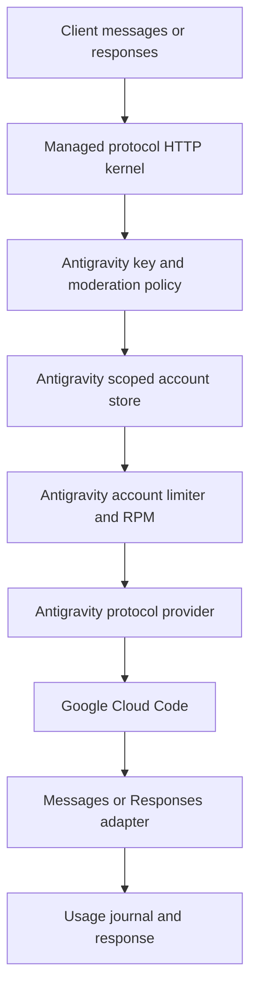

# Antigravity 独立 crate 重构设计

## 1. 目标与边界

目标是让 Antigravity 成为一个真正独立的 provider 实现和 binary：

- Antigravity 的 OAuth、Cloud Code transport、模型目录探测、账号快照、工具适配和请求错误语义全部位于 `llm-access-antigravity` 及其协议 crate。
- Cursor、Grok、Grok Bot 的 crate 中不再出现 Antigravity provider、模型、OAuth 分支或 Antigravity registry。
- 两边只共享 provider-neutral 的控制面能力：账号凭证存储、Key/Group 策略、代理、并发/RPM、usage journal、moderation、HTTP 协议内核和数据库连接。
- 浏览器管理界面使用独立的 Antigravity 路由和账号详情；Cursor 账号池永远不会读取、展示或选择 Antigravity 账号。
- Antigravity binary 只初始化 Antigravity registry、Antigravity 维护任务和 Antigravity 管理路由，保持较低 RSS，并且可以单独发布和回滚。

这里的“复用”指复用无 provider 语义的内核和控制面，不是把 Antigravity 代码继续塞进 Cursor 模块后用 profile 开关隐藏。

## 2. 重构前已经确认的问题

当前 `llm-access-antigravity` 仍直接依赖 `llm-access-cursor`，入口调用的是 Cursor service 的 profile 分支（[`crates/llm-access-antigravity/src/main.rs`](../deps/llm-access/crates/llm-access-antigravity/src/main.rs):1-36，[`crates/llm-access-antigravity/Cargo.toml`](../deps/llm-access/crates/llm-access-antigravity/Cargo.toml):11-19）。这使得 Antigravity binary 的生命周期、配置和 HTTP 装配仍然由 Cursor crate 拥有。

Antigravity provider、模型常量和 `antigravity_only` registry 仍在 `llm-access-cursor-protocol`（[`src/providers/antigravity.rs`](../deps/llm-access/crates/llm-access-cursor-protocol/src/providers/antigravity.rs):1-100，[`src/registry.rs`](../deps/llm-access/crates/llm-access-cursor-protocol/src/registry.rs):28-113）。因此即使运行时只挂载一个 provider，代码依赖和命名边界仍然是混合的。

账号持久化目前使用名为 `llm_cursor_accounts` 的表，Antigravity 通过迁移扩大 Cursor 的 provider 检查约束（[`0090_antigravity_oauth.sql`](../deps/llm-access/crates/llm-access-migrations/migrations/postgres/0090_antigravity_oauth.sql):1-14）。OAuth session 也使用 `cursor_account_name` 外键（[`0080_oauth_sessions.sql`](../deps/llm-access/crates/llm-access-migrations/migrations/postgres/0080_oauth_sessions.sql):3-25）。这不是重复建表，但它把 provider-neutral 账号概念错误地命名成了 Cursor 账号，导致管理代码自然继续复用 Cursor 类型和 handler。

最近加入的 `ManagedAccountScope`、独立 Antigravity 路由和最小 registry 已经阻止了线上列表和运行时的直接串池，但它们属于过渡隔离层；它们不能替代 crate 和 domain 的拆分。

## 3. 目标 crate 结构

```text
llm-access-core
  provider-neutral account, key, group, proxy, usage contracts

llm-access-managed-protocol   new
  Messages / Responses HTTP conversion
  SSE lifecycle, tool lifecycle, monitor context
  no Cursor, Grok, or Antigravity names

llm-access-antigravity-protocol   new
  AntigravityProvider
  Cloud Code request and stream conversion
  Antigravity model catalog and tool mapping
  Antigravity snapshot and account health
  Antigravity credential refresh helpers

llm-access-antigravity
  standalone binary
  Antigravity bootstrap and router
  Antigravity OAuth endpoints
  Antigravity account admin adapter

llm-access-cursor-protocol
  Cursor, Grok, Grok Bot providers only

llm-access-cursor
  Cursor/Grok binary and admin adapter only

llm-access
  shared control-plane implementation and provider-neutral services
llm-access-store / llm-access-oauth
  shared persistence and OAuth session primitives only
```

`llm-access-managed-protocol` 是真正的共享层。它可以被两个 data-plane crate 依赖，但不允许导入任何 provider-specific module。若提取过程中发现某个函数依赖 Cursor 专属模型或 usage 类型，应把该类型下沉到对应 provider crate，而不是把 Antigravity 重新放回 Cursor crate。

## 4. 账号与持久化设计

### 4.1 逻辑域

新增 provider-neutral 类型：

- `ManagedAccount`：账号身份、状态、来源、凭证引用、代理和限流策略。
- `ManagedAccountProvider`：`Cursor`、`Grok`、`GrokBot`、`Antigravity`。
- `AccountScope`：一个 data plane 允许访问的 provider 集合。
- `ManagedAccountStore`：带 scope 参数的 list/get/create/patch/delete/credential CAS 接口。
- `OAuthBindingStore`：OAuth session 与 managed account 的绑定关系，不再使用 `cursor_account_name` 这种 provider-specific 字段。

Cursor/Grok 需要一个 scope，允许 `Cursor + Grok + GrokBot`；Antigravity 需要另一个 scope，只允许 `Antigravity`。scope 必须在 store 查询和 mutation 层生效，不能由 handler 读取 URL 后再过滤结果。

### 4.2 物理表迁移

不新建一套重复的 Antigravity 账号表。迁移到 provider-neutral 的 `llm_managed_accounts`，保留一份账号策略和凭证所有权：

1. 创建新表并复制 `llm_cursor_accounts` 的现有行，字段改为 provider-neutral 命名。
2. 给 `provider` 建约束和索引；Antigravity 是普通 provider 值，不再由 Cursor 表约束承载。
3. 将 OAuth session 的 `cursor_account_name` 迁移为 `managed_account_name`，更新外键、触发器和 CAS 函数。
4. 将 usage、route、group 关联改到新表。
5. 完成双读校验后删除旧表和旧兼容字段；不保留运行时双写或隐式 fallback。

迁移脚本必须支持在切换前做行数、provider 分布、OAuth 绑定数、凭证 digest 和 usage 外键校验。任何一项不一致都阻止切换。

## 5. Antigravity data plane 请求流



Antigravity binary启动时只构造：

- Antigravity registry 和模型 catalog；
- Antigravity account snapshot refresh；
- Antigravity OAuth/admin routes；
- provider-neutral moderation、limiter、usage journal。

它不构造 Grok reset service、不导入 Cursor/Grok registry、不挂载 Cursor key/group/admin 路由，也不加载 Cursor 专属模型目录。

## 6. OAuth 与账号管理

OAuth 分成两层：

1. `llm-access-oauth` 只负责 session 生命周期、CSRF/state、远程 callback、绑定状态和安全存储接口。
2. `llm-access-antigravity` 提供 Google Authorization Code + PKCE、Cloud Code project/tier 探测、token refresh 和 Antigravity account import adapter。

成功登录必须在同一个事务中完成：校验 callback → 交换 token → 读取 Google identity → 创建或更新 Antigravity managed account → 绑定 OAuth session → 写入审计结果。保存失败时返回明确的可重试状态，并保留 session 中的加密凭证；不能要求用户重新登录，也不能让前端只看到“授权完成、尚未保存”。

浏览器路由只使用 `/console/antigravity/accounts` 和 `/admin/antigravity-gateway/*`。Cursor 路由只使用 `/console/cursor/accounts` 和 `/admin/cursor-gateway/*`。两套 handler 接收各自的 `AccountScope`，不通过 URI 字符串推断 provider。

## 7. 模型、messages、responses 与工具

Antigravity crate 对外提供同一套公共 HTTP 合约：

- `GET /v1/models` 只返回当前 Antigravity catalog 和账号实际探测到的模型。
- `POST /v1/messages` 保留 Anthropic messages 语义、thinking、图片、JSON mode 和工具调用。
- `POST /v1/responses` 使用共享协议内核转换为 messages，并将 Cloud Code stream 映射回 Responses SSE/JSON 生命周期。
- `POST /v1/messages/count_tokens` 使用 Antigravity 自己的 token 估算/上游能力，不调用 Cursor 计费逻辑。

内置工具必须按所有权区分：

- Google grounding/web search 由 Antigravity provider 生成和解析，返回 grounding chunks 与 web citation。
- 客户端自带的 function/tool call 由共享协议内核保留其生命周期和 call id，传给 Antigravity 的工具转换只在 Antigravity crate 内实现。
- Cursor/Grok 的 hosted search、Cursor workflow、Grok Bot tool schema 不得进入 Antigravity registry 或模型分支。

## 8. 并发、路由和内存目标

账号限流策略继续由共享控制面保存，但执行实例按 scope 隔离：

- Antigravity 默认账号并发为当前配置值，RPM 与最小启动间隔在 account lease 层执行。
- 多账号采用 Antigravity 专属候选池；失败转移只在 Antigravity 账号之间发生。
- Cursor/Grok 的候选池永远不会成为 Antigravity fallback。
- 进程只初始化一个 provider registry，避免当前 profile 方案仍然链接并保留 Cursor/Grok 运行时对象。

验收需要同时记录 RSS、启动时间和 `/v1/models` 响应：以当前独立 binary 的 RSS 作为基线，拆分后必须证明没有因新的协议复制导致 RSS 增长；只有在真实 release binary 和空闲、单请求、并发请求三种状态下都测量后，才能宣称内存优化完成。

## 9. 分阶段执行顺序

### 阶段一：冻结边界

- 冻结当前已部署的 scope 隔离和前端路由。
- 建立 provider-neutral 类型和 `llm-access-managed-protocol` crate。
- 为 Cursor/Grok 与 Antigravity 各写一条 scope contract 测试。

### 阶段二：抽取协议内核

- 从 `llm-access-cursor-protocol` 抽取 messages/responses、SSE、monitor、request context、tool lifecycle 到 managed protocol。
- Cursor crate 改为依赖 managed protocol；行为测试保持全量通过。
- managed protocol 中禁止 provider-specific import。

### 阶段三：迁移 Antigravity provider

- 将 `providers/antigravity.rs`、Antigravity model catalog、Cloud Code stream/parser、snapshot、auth refresh 和测试迁移到 `llm-access-antigravity-protocol`。
- Cursor registry 删除 Antigravity 常量、handler、alias 和 `antigravity_only` 分支。
- Antigravity registry 在自己的 crate 中构造。

### 阶段四：重建 Antigravity binary

- `llm-access-antigravity` 删除 `llm-access-cursor` 依赖。
- 新 binary 自己装配 managed protocol + Antigravity provider + provider-neutral control plane。
- 删除 `GatewayProfile` 这种把两个 binary 绑定在一起的运行时分支。

### 阶段五：账号存储迁移

- 执行 `llm_managed_accounts` 和 `managed_account_name` 迁移。
- 切换 store、OAuth、usage、route、admin handler 到 scope-aware provider-neutral 接口。
- 运行迁移一致性检查，确认现有 Antigravity OAuth 凭证 digest 不变。

### 阶段六：前端与发布

- 账号列表只展示摘要；模型目录、套餐、身份、warning 放在 Antigravity 详情页。
- OAuth 保存结果使用明确的 pending/saved/failed 状态。
- 分别构建和发布 Cursor、Antigravity binary；只重启受影响 service。
- 线上验证账号列表、模型目录、messages、responses、工具调用、并发/RPM 和服务 restart counter。

## 10. 必须通过的验收条件

- `llm-access-antigravity/Cargo.toml` 不再依赖 `llm-access-cursor` 或 `llm-access-cursor-protocol`。
- `rg antigravity crates/llm-access-cursor crates/llm-access-cursor-protocol` 只允许迁移说明或明确拒绝兼容的历史迁移文本；不得出现 provider 实现、registry、模型解析或 OAuth 分支。
- Cursor `/v1/models`、Cursor admin accounts 和 Cursor route candidate 中没有 Antigravity。
- Antigravity `/v1/models`、admin accounts 和 route candidate 中只有 Antigravity。
- 已有 Google OAuth session 可以直接保存为 managed account，不需要再次登录。
- Antigravity 的 27 个已探测模型、Google AI Pro 身份和 warning 语义在迁移前后保持一致；付费 tier 存在时不显示无关的免费 tier location warning。
- messages/responses 的普通文本、thinking、图片、JSON mode、function tools、Google web grounding 和 citation 均有真实上游或录制 fixture 覆盖。
- Rustfmt 只运行在精确变更文件；受影响 crate 的 test 和 `cargo clippy --all-targets -- -D warnings` 全部通过。
- 线上 release binary 的 SHA、service active、`NRestarts`、RSS 和真实请求结果均有记录。

## 11. 重构前后的代码索引

| 路径 | 当前职责 | 重构后职责 |
|---|---|---|
| `crates/llm-access-antigravity/src/main.rs` | 通过 Cursor service profile 启动 | 独立装配 Antigravity binary |
| `crates/llm-access-cursor/src/service.rs` | 同时承载 Cursor 与 Antigravity profile | 只承载 Cursor/Grok/Grok Bot |
| `crates/llm-access-cursor-protocol/src/providers/antigravity.rs` | Antigravity transport | 迁移到 Antigravity protocol crate |
| `crates/llm-access-cursor-protocol/src/registry.rs` | 混合 registry 与 Antigravity-only 分支 | 只保留 Cursor/Grok registry |
| `crates/llm-access/src/admin/cursor.rs` | 共享 Cursor 命名的账号 handler | 改为 provider-neutral store adapter；Cursor/Antigravity 各自薄 handler |
| `crates/llm-access-migrations/migrations/postgres/0071_cursor_accounts.sql` | Cursor 命名账号表 | 迁移为 `llm_managed_accounts` |
| `crates/llm-access-migrations/migrations/postgres/0080_oauth_sessions.sql` | `cursor_account_name` OAuth 外键 | `managed_account_name` provider-neutral 外键 |
| `apps/llm-access-frontend/src/console/pages/InventoryPage.tsx` | 两个账号页面共用 inventory 基础组件 | 保留基础组件，provider 配置和详情行为完全分离 |
| `apps/llm-access-frontend/src/console/account-editor.tsx` | Cursor 命名的上游详情组件同时显示 Antigravity | 使用 provider-specific detail sections |

这份文档保留原始冻结设计；第 2 节和第 11 节记录重构前的结构。实现后的状态与发布验收记录见下文。


## 12. 实现与发布方式

独立协议 crate 和启动入口已实现：`llm-access-managed-protocol` 提供 HTTP/SSE 内核，`llm-access-antigravity-protocol` 拥有 Google PKCE、Cloud Code、模型快照及工具转换。`llm-access-antigravity` 独立构造 registry 和维护任务，普通依赖树不再包含 Cursor crate。

账号接口已迁移到 `ManagedAccountStore` 和 `AccountScope`。迁移 91 创建并逐字段校验 `llm_managed_accounts`，更新 OAuth 列、函数、触发器和所有引用外键，最后删除旧表。成功 OAuth 登录原子绑定账号；账号保存冲突保留可重试的 OAuth。重启 OAuth 管理器后仍可从列表创建账号。

工具调用通过共享 Responses 内核保留 opaque reasoning 数据，Antigravity 在其中保存 Google function-call 签名和上游 ID。工具结果使用原函数名及上游 ID；并行调用、UTF-8 分块、流中断、引用和 buffered Responses 均有测试覆盖。

首次部署必须使用 `scripts/release_llm_access_cloud_managed_accounts.sh` 协调 API、usage worker、Cursor、Antigravity 和 OAuth，因为它们共享迁移后的账号表。脚本先构建并校验五个二进制，再停止受影响服务、迁移并校验、安装和启动；失败时先恢复旧 schema 和函数，再恢复旧程序。此后 Antigravity 的独立发布继续使用 `scripts/release_llm_access_cloud_antigravity_only.sh`。

公开 Antigravity 地址为 `/api/antigravity-gateway/v1`，Caddy 转发到独立的 `127.0.0.1:19095`。Cursor 保留自己的 `/api/cursor-gateway/v1`。发布后的实际验收数据会记录在此节。
