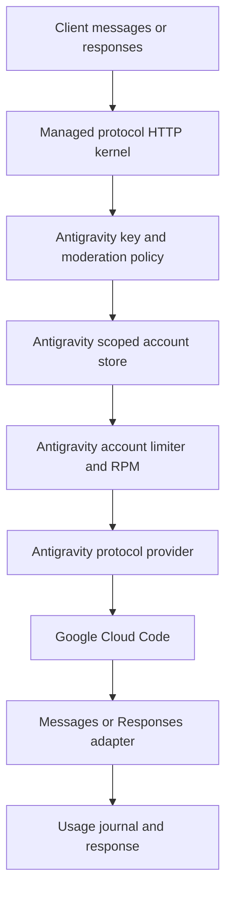

# Antigravity 独立 crate 重构设计

状态：2026-09-13 已完成代码拆分、生产迁移、独立 Key 管理、账号额度展示和模型定价补齐。第 2、11 节保留重构前的设计依据；核心拆分验收见第 12、13 节，后续补齐及真实 FX/计量复验见第 14 节，Gemini 3.8 Flash 默认模型策略见第 15 节。

## 1. 目标与边界

目标是让 Antigravity 成为一个真正独立的 provider 实现和 binary：

- Antigravity 的 OAuth、Cloud Code transport、模型目录探测、账号快照、工具适配和请求错误语义全部位于 `llm-access-antigravity` 及其协议 crate。
- Cursor、Grok、Grok Bot 的 crate 中不再出现 Antigravity provider、模型、OAuth 分支或 Antigravity registry。
- 两边只共享 provider-neutral 的控制面能力：账号凭证存储、Key/Group 策略、代理、并发/RPM、usage journal、moderation、HTTP 协议内核和数据库连接。
- 浏览器管理界面使用独立的 Antigravity 路由和账号详情；Cursor 账号池永远不会读取、展示或选择 Antigravity 账号。
- Antigravity binary 只初始化 Antigravity registry、Antigravity 维护任务和 Antigravity 管理路由，保持较低 RSS，并且可以单独发布和回滚。

这里的“复用”指复用无 provider 语义的内核和控制面，不是把 Antigravity 代码继续塞进 Cursor 模块后用 profile 开关隐藏。

## 2. 重构前已经确认的问题

当前 `llm-access-antigravity` 仍直接依赖 `llm-access-cursor`，入口调用的是 Cursor service 的 profile 分支（[`crates/llm-access-antigravity/src/main.rs`](../deps/llm-access/crates/llm-access-antigravity/src/main.rs):1-36，[`crates/llm-access-antigravity/Cargo.toml`](../deps/llm-access/crates/llm-access-antigravity/Cargo.toml):11-19）。这使得 Antigravity binary 的生命周期、配置和 HTTP 装配仍然由 Cursor crate 拥有。

Antigravity provider、模型常量和 `antigravity_only` registry 仍在 `llm-access-cursor-protocol`（[`src/providers/antigravity.rs`](../deps/llm-access/crates/llm-access-cursor-protocol/src/providers/antigravity.rs):1-100，[`src/registry.rs`](../deps/llm-access/crates/llm-access-cursor-protocol/src/registry.rs):28-113）。因此即使运行时只挂载一个 provider，代码依赖和命名边界仍然是混合的。

账号持久化目前使用名为 `llm_cursor_accounts` 的表，Antigravity 通过迁移扩大 Cursor 的 provider 检查约束（[`0090_antigravity_oauth.sql`](../deps/llm-access/crates/llm-access-migrations/migrations/postgres/0090_antigravity_oauth.sql):1-14）。OAuth session 也使用 `cursor_account_name` 外键（[`0080_oauth_sessions.sql`](../deps/llm-access/crates/llm-access-migrations/migrations/postgres/0080_oauth_sessions.sql):3-25）。这不是重复建表，但它把 provider-neutral 账号概念错误地命名成了 Cursor 账号，导致管理代码自然继续复用 Cursor 类型和 handler。

最近加入的 `ManagedAccountScope`、独立 Antigravity 路由和最小 registry 已经阻止了线上列表和运行时的直接串池，但它们属于过渡隔离层；它们不能替代 crate 和 domain 的拆分。

## 3. 目标 crate 结构

```text
llm-access-core
  provider-neutral account, key, group, proxy, usage contracts

llm-access-managed-protocol   new
  Messages / Responses HTTP conversion
  SSE lifecycle, tool lifecycle, monitor context
  no Cursor, Grok, or Antigravity names

llm-access-antigravity-protocol   new
  AntigravityProvider
  Cloud Code request and stream conversion
  Antigravity model catalog and tool mapping
  Antigravity snapshot and account health
  Antigravity credential refresh helpers

llm-access-antigravity
  standalone binary
  Antigravity bootstrap and router
  Antigravity OAuth endpoints
  Antigravity account admin adapter

llm-access-cursor-protocol
  Cursor, Grok, Grok Bot providers only

llm-access-cursor
  Cursor/Grok binary and admin adapter only

llm-access
  shared control-plane implementation and provider-neutral services
llm-access-store / llm-access-oauth
  shared persistence and OAuth session primitives only
```

`llm-access-managed-protocol` 是真正的共享层。它可以被两个 data-plane crate 依赖，但不允许导入任何 provider-specific module。若提取过程中发现某个函数依赖 Cursor 专属模型或 usage 类型，应把该类型下沉到对应 provider crate，而不是把 Antigravity 重新放回 Cursor crate。

## 4. 账号与持久化设计

### 4.1 逻辑域

新增 provider-neutral 类型：

- `ManagedAccount`：账号身份、状态、来源、凭证引用、代理和限流策略。
- `ManagedAccountProvider`：`Cursor`、`Grok`、`GrokBot`、`Antigravity`。
- `AccountScope`：一个 data plane 允许访问的 provider 集合。
- `ManagedAccountStore`：带 scope 参数的 list/get/create/patch/delete/credential CAS 接口。
- `OAuthBindingStore`：OAuth session 与 managed account 的绑定关系，不再使用 `cursor_account_name` 这种 provider-specific 字段。

Cursor/Grok 需要一个 scope，允许 `Cursor + Grok + GrokBot`；Antigravity 需要另一个 scope，只允许 `Antigravity`。scope 必须在 store 查询和 mutation 层生效，不能由 handler 读取 URL 后再过滤结果。

### 4.2 物理表迁移

不新建一套重复的 Antigravity 账号表。迁移到 provider-neutral 的 `llm_managed_accounts`，保留一份账号策略和凭证所有权：

1. 创建新表并复制 `llm_cursor_accounts` 的现有行，字段改为 provider-neutral 命名。
2. 给 `provider` 建约束和索引；Antigravity 是普通 provider 值，不再由 Cursor 表约束承载。
3. 将 OAuth session 的 `cursor_account_name` 迁移为 `managed_account_name`，更新外键、触发器和 CAS 函数。
4. 将 usage、route、group 关联改到新表。
5. 完成双读校验后删除旧表和旧兼容字段；不保留运行时双写或隐式 fallback。

迁移脚本必须支持在切换前做行数、provider 分布、OAuth 绑定数、凭证 digest 和 usage 外键校验。任何一项不一致都阻止切换。

## 5. Antigravity data plane 请求流



Antigravity binary启动时只构造：

- Antigravity registry 和模型 catalog；
- Antigravity account snapshot refresh；
- Antigravity OAuth/admin routes；
- provider-neutral moderation、limiter、usage journal。

它不构造 Grok reset service、不导入 Cursor/Grok registry、不挂载 Cursor key/group/admin 路由，也不加载 Cursor 专属模型目录。

## 6. OAuth 与账号管理

OAuth 分成两层：

1. `llm-access-oauth` 只负责 session 生命周期、CSRF/state、远程 callback、绑定状态和安全存储接口。
2. `llm-access-antigravity` 提供 Google Authorization Code + PKCE、Cloud Code project/tier 探测、token refresh 和 Antigravity account import adapter。

成功登录必须在同一个事务中完成：校验 callback → 交换 token → 读取 Google identity → 创建或更新 Antigravity managed account → 绑定 OAuth session → 写入审计结果。保存失败时返回明确的可重试状态，并保留 session 中的加密凭证；不能要求用户重新登录，也不能让前端只看到“授权完成、尚未保存”。

浏览器路由只使用 `/console/antigravity/accounts` 和 `/admin/antigravity-gateway/*`。Cursor 路由只使用 `/console/cursor/accounts` 和 `/admin/cursor-gateway/*`。两套 handler 接收各自的 `AccountScope`，不通过 URI 字符串推断 provider。

## 7. 模型、messages、responses 与工具

Antigravity crate 对外提供同一套公共 HTTP 合约：

- `GET /v1/models` 只返回当前 Antigravity catalog 和账号实际探测到的模型。
- `POST /v1/messages` 保留 Anthropic messages 语义、thinking、图片、JSON mode 和工具调用。
- `POST /v1/responses` 使用共享协议内核转换为 messages，并将 Cloud Code stream 映射回 Responses SSE/JSON 生命周期。
- `POST /v1/messages/count_tokens` 使用 Antigravity 自己的 token 估算/上游能力，不调用 Cursor 计费逻辑。

内置工具必须按所有权区分：

- Google grounding/web search 由 Antigravity provider 生成和解析，返回 grounding chunks 与 web citation。
- 客户端自带的 function/tool call 由共享协议内核保留其生命周期和 call id，传给 Antigravity 的工具转换只在 Antigravity crate 内实现。
- Cursor/Grok 的 hosted search、Cursor workflow、Grok Bot tool schema 不得进入 Antigravity registry 或模型分支。

## 8. 并发、路由和内存目标

账号限流策略继续由共享控制面保存，但执行实例按 scope 隔离：

- Antigravity 默认账号并发为当前配置值，RPM 与最小启动间隔在 account lease 层执行。
- 多账号采用 Antigravity 专属候选池；失败转移只在 Antigravity 账号之间发生。
- Cursor/Grok 的候选池永远不会成为 Antigravity fallback。
- 进程只初始化一个 provider registry，避免当前 profile 方案仍然链接并保留 Cursor/Grok 运行时对象。

验收需要同时记录 RSS、启动时间和 `/v1/models` 响应：以当前独立 binary 的 RSS 作为基线，拆分后必须证明没有因新的协议复制导致 RSS 增长；只有在真实 release binary 和空闲、单请求、并发请求三种状态下都测量后，才能宣称内存优化完成。

## 9. 分阶段执行顺序

### 阶段一：冻结边界

- 冻结当前已部署的 scope 隔离和前端路由。
- 建立 provider-neutral 类型和 `llm-access-managed-protocol` crate。
- 为 Cursor/Grok 与 Antigravity 各写一条 scope contract 测试。

### 阶段二：抽取协议内核

- 从 `llm-access-cursor-protocol` 抽取 messages/responses、SSE、monitor、request context、tool lifecycle 到 managed protocol。
- Cursor crate 改为依赖 managed protocol；行为测试保持全量通过。
- managed protocol 中禁止 provider-specific import。

### 阶段三：迁移 Antigravity provider

- 将 `providers/antigravity.rs`、Antigravity model catalog、Cloud Code stream/parser、snapshot、auth refresh 和测试迁移到 `llm-access-antigravity-protocol`。
- Cursor registry 删除 Antigravity 常量、handler、alias 和 `antigravity_only` 分支。
- Antigravity registry 在自己的 crate 中构造。

### 阶段四：重建 Antigravity binary

- `llm-access-antigravity` 删除 `llm-access-cursor` 依赖。
- 新 binary 自己装配 managed protocol + Antigravity provider + provider-neutral control plane。
- 删除 `GatewayProfile` 这种把两个 binary 绑定在一起的运行时分支。

### 阶段五：账号存储迁移

- 执行 `llm_managed_accounts` 和 `managed_account_name` 迁移。
- 切换 store、OAuth、usage、route、admin handler 到 scope-aware provider-neutral 接口。
- 运行迁移一致性检查，确认现有 Antigravity OAuth 凭证 digest 不变。

### 阶段六：前端与发布

- 账号列表只展示摘要；模型目录、套餐、身份、warning 放在 Antigravity 详情页。
- OAuth 保存结果使用明确的 pending/saved/failed 状态。
- 分别构建和发布 Cursor、Antigravity binary；只重启受影响 service。
- 线上验证账号列表、模型目录、messages、responses、工具调用、并发/RPM 和服务 restart counter。

## 10. 必须通过的验收条件

- `llm-access-antigravity/Cargo.toml` 不再依赖 `llm-access-cursor` 或 `llm-access-cursor-protocol`。
- `rg antigravity crates/llm-access-cursor crates/llm-access-cursor-protocol` 只允许迁移说明或明确拒绝兼容的历史迁移文本；不得出现 provider 实现、registry、模型解析或 OAuth 分支。
- Cursor `/v1/models`、Cursor admin accounts 和 Cursor route candidate 中没有 Antigravity。
- Antigravity `/v1/models`、admin accounts 和 route candidate 中只有 Antigravity。
- 已有 Google OAuth session 可以直接保存为 managed account，不需要再次登录。
- Antigravity 的 27 个已探测模型、Google AI Pro 身份和 warning 语义在迁移前后保持一致；付费 tier 存在时不显示无关的免费 tier location warning。
- messages/responses 的普通文本、thinking、图片、JSON mode、function tools、Google web grounding 和 citation 均有真实上游或录制 fixture 覆盖。
- Rustfmt 只运行在精确变更文件；受影响 crate 的 test 和 `cargo clippy --all-targets -- -D warnings` 全部通过。
- 线上 release binary 的 SHA、service active、`NRestarts`、RSS 和真实请求结果均有记录。

## 11. 重构前后的代码索引

| 路径 | 当前职责 | 重构后职责 |
|---|---|---|
| `crates/llm-access-antigravity/src/main.rs` | 通过 Cursor service profile 启动 | 独立装配 Antigravity binary |
| `crates/llm-access-cursor/src/service.rs` | 同时承载 Cursor 与 Antigravity profile | 只承载 Cursor/Grok/Grok Bot |
| `crates/llm-access-cursor-protocol/src/providers/antigravity.rs` | Antigravity transport | 迁移到 Antigravity protocol crate |
| `crates/llm-access-cursor-protocol/src/registry.rs` | 混合 registry 与 Antigravity-only 分支 | 只保留 Cursor/Grok registry |
| `crates/llm-access/src/admin/cursor.rs` | 共享 Cursor 命名的账号 handler | 改为 provider-neutral store adapter；Cursor/Antigravity 各自薄 handler |
| `crates/llm-access-migrations/migrations/postgres/0071_cursor_accounts.sql` | Cursor 命名账号表 | 迁移为 `llm_managed_accounts` |
| `crates/llm-access-migrations/migrations/postgres/0080_oauth_sessions.sql` | `cursor_account_name` OAuth 外键 | `managed_account_name` provider-neutral 外键 |
| `apps/llm-access-frontend/src/console/pages/InventoryPage.tsx` | 两个账号页面共用 inventory 基础组件 | 保留基础组件，provider 配置和详情行为完全分离 |
| `apps/llm-access-frontend/src/console/account-editor.tsx` | Cursor 命名的上游详情组件同时显示 Antigravity | 使用 provider-specific detail sections |

这份文档保留原始冻结设计；第 2 节和第 11 节记录重构前的结构。实现后的状态与发布验收记录见下文。


## 12. 实现与发布方式

独立协议 crate 和启动入口已实现：`llm-access-managed-protocol` 提供 HTTP/SSE 内核，`llm-access-antigravity-protocol` 拥有 Google PKCE、Cloud Code、模型快照及工具转换。`llm-access-antigravity` 独立构造 registry 和维护任务，普通依赖树不再包含 Cursor crate。

账号接口已迁移到 `ManagedAccountStore` 和 `AccountScope`。迁移 91 创建并逐字段校验 `llm_managed_accounts`，更新 OAuth 列、函数、触发器和所有引用外键，最后删除旧表。成功 OAuth 登录原子绑定账号；账号保存冲突保留可重试的 OAuth。重启 OAuth 管理器后仍可从列表创建账号。

工具调用通过共享 Responses 内核保留 opaque reasoning 数据，Antigravity 在其中保存 Google function-call 签名和上游 ID。工具结果使用原函数名及上游 ID；并行调用、UTF-8 分块、流中断、引用和 buffered Responses 均有测试覆盖。

首次部署必须使用 `scripts/release_llm_access_cloud_managed_accounts.sh` 协调 API、usage worker、Cursor、Antigravity 和 OAuth，因为它们共享迁移后的账号表。脚本先构建并校验五个二进制，再停止受影响服务、迁移并校验、安装和启动；失败时先恢复旧 schema 和函数，再恢复旧程序。后续仅 provider 变更时，独立构建并替换 Antigravity 二进制即可；现有 `scripts/release_llm_access_cloud_antigravity_only.sh` 会同时发布 OAuth manager，只在 OAuth 也需更新时使用。

公开 Antigravity 地址为 `/api/antigravity-gateway/v1`，Caddy 转发到独立的 `127.0.0.1:19095`。Cursor 保留自己的 `/api/cursor-gateway/v1`。生产入口已启用；实际验收数据见下一节。


## 13. 2026-09-13 发布与验收记录

### 源码和部署

核心拆分版本为子仓库 `2cbd9b14ff20cde8713e5a6232124148a174bcbd`；计量补齐后的最终版本为 `1f62513089b55de087c09016346953636257d191`，已推送到子仓库 `main`，父仓库记录最终版本的 gitlink。首次完整迁移的发布批次为 `20260913T114443Z-2cbd9b14ff20-managed`，五个服务于 **11:45:36 UTC** 启动。

迁移 91 保留全部 4 个账号（Cursor、Grok、Grok Bot、Antigravity 各 1 个）；迁移前后的完整账号字段、凭证摘要、OAuth 绑定及入向/出向外键检查一致。旧账号表已删除，运行时只使用 managed account schema。

首次切换曾因发布脚本误用 usage worker 的 `/healthz` 而自动回滚。旧 schema、函数和五个旧二进制恢复后，全部真实健康接口返回 200。修正为 `/admin/llm-access/usage-worker/status` 后重新发布成功，回滚路径也获得了生产实证。

| 服务 | 首次协调部署的二进制 SHA-256 |
|---|---|
| API | `aeaff2a9d8161e79539c96cf4a61761c2b04935e8c7dd9aab6447f25d362f2c8` |
| usage worker | `5bafd69a821ab6390e82080aa80e96d70be6f830794921fe9937f641c6cf05c1` |
| Cursor | `1a183dff8b746a9f703db6f451a3b363a655321cd018f9e6a4556fdd8f026e84` |
| Antigravity | `2445bd3a985b81685de3874983779f408bb0cb41a4763c41759d2ec92c952024` |
| OAuth | `d3b9dd8ca5aa1d7846eaa87689395828f1fa0dafd07ac5af55caf59d861cbacc` |

首轮真实任务结束后，这五个服务仍为 `active`、`NRestarts=0`，`/proc/<pid>/exe` 的 SHA 与清单逐项相同。Caddy 仅热重载，PID 保持 `55768`；本地 Pingora 未重启。

### 边界、质量和性能

- `cargo tree -p llm-access-antigravity --edges normal` 不含 Cursor crate；Cursor 源码不再包含 Antigravity provider 或 registry。
- Cursor 管理接口仅有 3 个所属账号；Antigravity 仅有自己的 1 个账号。Antigravity `/v1/models` 返回 29 个条目，全部 `owned_by=antigravity`，移除了原有 Cursor 别名 `claude-fable-5-1[1m]`。账号探测快照的 27 个模型、身份、套餐和 warning 信息与迁移前逐项一致。
- 工作区测试 **2,892 passed，0 failed，2 ignored**；最终变更还通过受影响库、scope 和真实 Postgres 迁移回归。工作区及独立 Antigravity 的 `clippy --all-targets -- -D warnings` 通过。Rustfmt 只作用于精确文件。
- React typecheck/build、OAuth 页面重启后保存账号测试、发布脚本与回滚测试通过。真实浏览器账号详情显示 27 个模型和 Google AI Pro；390px 视口无横向溢出、无页面异常。
- Postgres 测试使用临时 schema-only Neon 分支；测试结束后删除该分支，未对生产数据库运行测试。

同一台 AWS 主机、release 构建、`gemini-3-flash`、相同三个短文本请求下，读取进程 `/proc/<pid>/status`：

| 测量时刻 | 重构前 RSS（KiB） | 重构后 RSS（KiB） |
|---|---:|---:|
| 空闲 | 150444 | 135780 |
| 单请求完成后 | 151636 | 136080 |
| 两路并发完成后 | 153208 | 137780 |

两路并发均正确返回各自结果。最终版本单请求耗时 3.770 秒，两路并发各耗时 2.280 / 3.082 秒。以上是对应时刻的 RSS，未测高负载峰值；空闲 RSS 约下降 9.7%。从 systemd 秒级启动时间到应用 `started_at` 的近似差值为重构前 3.0 秒、首次协调发布后 4.7 秒、最终独立更新后 2.9 秒；这些单次测量不代表启动性能的统计结论。

### FX 真实任务

使用 `~/rust_pro/fx/zig-out/bin/fx`（FX 源码 `ae263104`），沿用现有配置的公网 origin，将入口设为 `https://ackingliu.top/api/antigravity-gateway/v1`，模型 `gemini-3-flash`。新建验证 Key `antigravity-fx-refactor-20260913`，仅绑定 Antigravity 账号；凭证保存在本地权限为 0600 的隔离 profile，未写入仓库或覆盖用户的 FX 配置。

在隔离可写目录 `/tmp/antigravity-fx-task` 中执行 `fx ask --yolo --json --no-color`，要求修复 CSV 订单报表：使用 Decimal、处理付款/退款/待付款、保留 Unicode 和带逗号客户名、拒绝非法金额与状态、编写并运行测试。

FX 最终 **exit_code=0，15 步，15 次工具调用**，实际读写文件、运行 `python3 -m unittest test_summarize.py -v` 和 `python3 summarize.py orders.csv`。9 项测试通过，报表为：

```json
{"net_total":"1010.25","customers":{"张三":"10.00","李四":"0.20","王五,公司":"1000.05"}}
```

独立复核重新运行 9 项测试，并额外验证未知状态、NaN、Infinity、负金额、非法金额字符串、仅待付款客户排除及净退款结果。输入 CSV 未改变。现有账号保留 10 RPM 限制；任务中发生 429，FX 自动退避后在第 6 次尝试恢复，随后完成任务。

本地验收证据为 `/tmp/antigravity-fx-result.json`、`/tmp/antigravity-fx-verification.json`、`/tmp/antigravity-live-baseline.json`、`/tmp/antigravity-live-after.json` 和 `/tmp/antigravity-final-state.json`；含账号/Key 的运行记录仅保留在本机。发布目录中的 `activation.json` 记录迁移摘要、服务状态和二进制 SHA。


### 最终计量补齐

首轮真实任务归档后发现，Antigravity 的响应虽然包含 token 数，但原有适配器未向共享 monitor 上报，导致用量明细标记 `usage_missing=true`。子仓库 `1f62513089b55de087c09016346953636257d191` 在 Antigravity 协议边界补齐上报：流式和非流式请求共用真实 `usageMetadata`，通过 `UsageProvenanceHandle` 传给 Responses 转换并写入 monitor。

按 [Google UsageMetadata 定义](https://ai.google.dev/api/generate-content#UsageMetadata)，输入总数包含缓存，生成总数包含候选输出和 thinking；重复累计快照不重复计费，缺失完整用量时仍保留未知状态。补充测试覆盖缓存分桶、thinking、部分快照和真实流式完成通知。最终 Antigravity 协议 16 项测试通过，Antigravity/OAuth 相关回归与零警告 Clippy 通过。


该修复通过独立 Antigravity 构建发布，批次 `20260913T115845Z-1f62513089b5-ag-usage`，运行 SHA-256 为 `30076532a0d0f0d3be659a8543b6dab725d5f34c4cb08fcfdbbd917b7a25835c`。API、usage worker、Cursor、OAuth 的 PID、状态和重启计数均保持不变。上面的 RSS 表使用此最终版本的复测值。

公网非流式 Responses JSON mode 实测返回 `{"ok":true}`，记录输入 14、输出 230（其中 reasoning 221）、总计 244 token；未携带 Key 的同接口请求返回 401。

最终版本又在 `/tmp/antigravity-fx-final-task` 从原始有缺陷的程序重新运行同一真实任务。FX 会话 `bhqMk4SJnmzA` 返回 `exit_code=0`，15 步、15 次工具调用，生成并通过 **11 项测试**，独立边界验证全部通过，报表仍为 `1010.25`。限流自动恢复最终记录为第 9 次尝试成功。最终任务与复核证据为 `/tmp/antigravity-fx-final-result.json` 和 `/tmp/antigravity-fx-final-verification.json`，隔离配置为 `/tmp/antigravity-fx-final-profile/gateway-auth.json`。

最终复验 Key 的控制面累计计量为：未缓存输入 101,849、缓存输入 121,387、输出 10,931 token，合计 234,167；10,000,000 配额剩余 9,765,833，与累计用量相符。此数包含最终版本的短请求、JSON mode 和 FX 复验。


最终归档明细共有 **20 条成功请求、8 条账号 RPM 限流记录**：成功请求包括 3 条 Messages、1 条非流式 Responses JSON mode 和 FX 的 16 轮 Responses。成功请求全部属于 Antigravity 账号，`usage_missing=false`；明细的输入、缓存、输出和计费总数与上面的 Key 累计计量逐项一致。最终状态和明细证据为 `/tmp/antigravity-final-state-metered.json`。截至 12:03 UTC 后的最终核对，五个受影响服务全部 active、`NRestarts=0`，运行 SHA 与各自发布清单一致；本次事项全部完成。


## 14. Key、账号额度和模型价格补齐

本次后续修复让 Antigravity 在共享策略表中使用独立的 `provider_type=antigravity`，
补齐 `/console/antigravity/keys` 与 `/console/antigravity/groups`。Key 支持创建、编辑、
停用、删除、配额、并发、账号绑定、审核和完整请求日志。账号及 Key 的读写与运行时认证
均按 provider 隔离；管理变更成功后立即刷新本地路由，刷新失败则暂停接受旧策略。

迁移 92 仅迁移明确绑定纯 Antigravity 账号集合的旧 Cursor Key/Group，保留原 secret、
配额、计量和账号凭证。混合组及未指定账号集合的 Cursor Key 保持原归属；历史原始
Usage 保留当时的 provider，新请求使用 Antigravity，账号累计计量迁到新归属。

账号池展示每个账号模型额度的百分比范围，展开后逐模型显示剩余比例与重置时间；详情页
同样显示，缺失值显示“未报告”，不会解释为 0%。快照包含更新时间，刷新失败保留上次
成功快照并提示。额度不在模型间相加，也不据此虚构绝对请求数。

迁移 93 补齐 22 项 Antigravity 与 7 项 Cursor Muse Spark 1.3 参考费率，已有自定义
费率不被覆盖。依据为 [Google Gemini 定价](https://ai.google.dev/gemini-api/docs/pricing)、
[Google 托管模型定价](https://cloud.google.com/gemini-enterprise-agent-platform/generative-ai/pricing)
及 [Cursor 定价](https://cursor.com/docs/models-and-pricing)。Antigravity 的旧 2.5 Flash
标识按当前账号目录实际展示的 Gemini 3.5 Flash Lite 定价；Gemini Pro 超过 200K 输入
时按整次请求应用长上下文费率。Gemini 3.6/3.7/3.8 的促销参考价截至 2026-12-31，
届时需按公布政策更新。这里的美元金额是公开 Token 参考成本，不代表订阅实际扣款。

价格页新增“检查缺价模型”，扫描 Antigravity、Cursor 账号快照及 Kiro 目录，并为
缺价项提供手动配置入口。按用户要求，`chat_20706`、`chat_23310`、
`tab_flash_lite_preview`、`tab_jump_flash_lite_preview` 标记为“待定价”，不写入零价。
`gemini-3.1-flash-image` 的文本和图像输出费率不同，现有单输出费率表无法准确表达；
Cursor 的 8 个 GPT Fast 标识尚无已核实的 Cursor 单价，也保留待定价。`default`
为自动选模入口，应按实际模型计价。

Kiro 缺价检查使用目录的 `target_model_id`，与实际计费模型一致；例如当前自定义的
`claude-fable-5`、`kimi-2.7`、`kimi-k3` 均映射到已有价格的 `claude-opus-5`，不能
根据公开别名另加价格。本次检查共显示 14 项待配置条目，点击“配置价格”会带入模型
标识，价格输入保持空白。

本次通过 `scripts/release_llm_access_cloud_antigravity_admin.sh` 完成一次性 schema
91 → 93 切换。五个受影响服务顺序构建；先启动新 API、Usage worker、Cursor、OAuth，
最后启动 Antigravity。启动 Antigravity 前可以还原原 provider 与二进制；此后必须保留
能解码新 Usage provider 的消费者并向前修复。发布脚本核对二进制与迁移文件 SHA，
迁移前后核对 Key 凭证、配额、累计用量及账号认证摘要。

### 生产发布与管理界面验收

功能版本 `320e0a21aad8a1db3a73f3c19cb7c5b480405935` 通过批次
`20260913T134758Z-320e0a21aad8-ag-admin` 发布，生产 schema 已为 93。原验证 Key
`antigravity-fx-refactor-20260913` 转为 Antigravity 归属后，secret、10,000,000 配额、
234,167 已用量及 9,765,833 剩余额度均保持不变。Cursor 仍有原来的 3 个账号，混合
Cursor 组和 Key 未被迁走。

真实 API 验证完成 Key/Group 创建、编辑、删除，固定组约束、停用立即生效与重新启用，
以及手动价格保存后读回。Cursor 管理接口修改 Antigravity Key 返回 404，Cursor
公网入口使用该 Key 返回 401。临时测试 Key、Group 和价格已删除。

真实浏览器验证 Key 编辑器可用、账号池及详情页均显示 27 个模型的上游额度；四个内部
模型均显示“待定价”，手动配置表单不预填零价。账号池和价格页在 390px 视口无页面
横向溢出，也无 JavaScript 异常。控制台沿用本地 `127.0.0.1:19191` 的生产构建。

工作区测试为 **2,900 passed、0 failed、2 ignored**；后续受影响库及协议测试
855 passed。最终账号计量修复另通过 1 项真实 Postgres 回归及 13 项相关计量测试。
最终工作区和独立 Antigravity 的 `clippy --all-targets -- -D warnings`、React
typecheck/build 均通过。Cargo 单独报告了依赖 `redis 1.6.0` 的 future-incompatibility
提示。迁移、回滚、幂等计量与补账测试使用隔离 Neon 分支，测试结束后已删除，查询确认
该分支不存在。

### 真实任务发现的账号计量遗漏与修复

使用新 Key `antigravity-fx-admin-20260913`，通过 FX 现有公网 origin 和 Antigravity
入口运行 Python JSONL 用量报表任务。会话 `ChvL63TXeG7k` 返回 exit 0，8 步、8 次
工具调用，完成代码修复和 5 项测试；独立复核通过报表结果及 6 项边界检查，输入不变。
这轮 9 个 Responses 请求均返回 200、`usage_missing=false`，Key 正确扣除 129,276
token，但账号累计量没有增加。

原因是共享 Postgres 的 `account_model_usage_upsert_builder` 仍只接受旧 provider。
最终版本 `9b38406454c36170404528e3e3fded8121ec50ca` 补齐 Antigravity 的账号归属
条件，并限制 Cursor 分支只接受非 Antigravity 账号。回归测试同时验证账号计量与 Key
扣量的幂等性。此修复只影响 producer 的控制面写入，usage worker 的职责是写 analytics。

修复通过批次 `20260913T141212Z-9b38406454c3-ag-rollup` 单独更新 Antigravity，
于 **14:12:56 UTC** 启动，运行二进制 SHA-256 为
`1e989b0355dc7f9a60151019be7c28872316378b0414d97111cf33105484c836`。
API、usage worker、Cursor、OAuth 的 PID 分别保持 2356945、2356934、2356946、
2356948；Antigravity 新 PID 为 2362234。全部 active、`NRestarts=0`。Caddy PID
保持 55768，本地 Pingora 未重启。

针对这 9 条已有原始日志，以事务锁定和精确前置计数执行一次账号补账：账号累计量
234,167 → 363,443，Key 已用量仍为 129,276。脚本核对 9 个已应用事件批次、Key
累计量、账号输入/缓存/输出及最后使用时间，只补账号计量，不重新提交 Key 扣量。
同一脚本在隔离数据库连续运行两次，第二次不重复增加统计；生产补账后 API 读回一致。

上线后在同一目录继续完成 stdin JSONL 支持和两项 CLI 集成测试，会话
`NFzqvSLiueWw` 生成并通过全部 **7 项测试**。账号原有 10 RPM 限制导致 FX 在最终
回答前耗尽自动重试而暂停；等待限流窗口后，使用原会话的 `--continue-recovery`
恢复，首个请求成功，最终 exit 0。独立复核确认 stdin/file 报表一致、6 项边界检查
通过，原始 fixture 未改变。本次没有提高账号 RPM。

新 Key 的隔离凭证保存在 `~/.config/llm-access/antigravity-fx/gateway-auth.json`
（目录 0700、文件 0600），用户原 `~/.fx/gateway-auth.json` 未被修改。验收产物为
`/tmp/ag-admin-fx-verification.json`、`/tmp/ag-admin-fx-postfix-verification.json`、
`/tmp/ag-admin-browser-verification.json` 与 `/tmp/ag-account-repair-production.json`；
含账号、Key 和完整请求的证据仅保留在本机。

### 最终 usage 核对（14:20 UTC）

以新 Key、`provider_type=antigravity`、明确起止时间查询，共 **40 条原始记录**：
30 条成功响应、9 条本地账号 10 RPM 限流（429），以及 1 条 Google 上游
`MODEL_CAPACITY_EXHAUSTED`（503）。所有成功请求 `usage_missing=false`；10 条
失败记录均为 0 billable token。两轮任务最终均完成；这不代表上游从未限流或暂时缺少
容量。

| 核对项 | 新 Key 两轮任务 | 账号累计（含原有 234,167） |
|---|---:|---:|
| 未缓存输入 | 152,295 | 254,144 |
| 缓存输入 | 283,187 | 404,574 |
| 输出 | 17,412 | 28,343 |
| billable token | 452,894 | 687,061 |

新 Key 剩余配额为 **9,547,106 / 10,000,000**。原始记录三类 token 之和与 Key
扣量逐项一致，账号对应增量也一致，按配置费率核算的账号参考成本为 **$0.2323297**。
最终成功明细包含 client request、upstream request、完整请求和 response body；
上游 Authorization 已脱敏，协议为 `antigravity-cloud-code`，流正常结束于
`response.completed`。

usage worker 已将本轮 31 条新记录导入活动 DuckDB（journal 文件序号 32117，
consumer state 记录 event_count=31）；连同前轮 9 条，查询可读回全部 40 条。
这些记录目前位于活动 DuckDB，尚未封存到冷归档，`source=archive` 此时为 0。
journal 的写入失败、丢弃文件和未消费丢弃计数均为 0，无 sealed backlog，
worker `last_error=null`。

历史数据仍有局限：账号保留 52 条旧 `usage_missing` 计数，本轮没有用量的
上游 503 增加 1 条，当前为 53；30 条成功请求没有新增缺失。两个旧 bad journal
文件分别来自 2026-06-30 和 2026-09-10，名称和大小均未变化，本次未修复这些历史
文件。最终证据为 `/tmp/ag-admin-usage-final.json` 和
`/tmp/ag-consumer-proof-final.json`，五个服务与 Caddy 仍 active、`NRestarts=0`，
运行二进制 SHA 与各自发布清单一致。

## 15. Gemini 3.8 Flash 默认模型

按用户要求，Antigravity 默认模型统一为 **Gemini 3.8 Flash**。当前账号目录中的
准确 ID 为 `gemini-3.8-flash-tiered`，不是 `gemini-3-flash`。

- Messages、count_tokens 和 Responses 请求未指定模型或使用 `default` 时，均走
  `gemini-3.8-flash-tiered`；显式选择其他模型时保留原选择。非法模型类型与非对象
  JSON 请求仍返回 400。
- 模型目录将其放在首位，并返回顶层 `default_model` 与条目 `is_default=true`。
  默认路由和账号模型匹配使用同一标准化规则，usage 记录实际使用的 3.8 模型。
- 已更新用户 `~/.fx/settings.json` 与独立 Antigravity FX profile 的 Gateway 模型
  偏好，并将 AI review 的 Antigravity 新建接入模板改为同一模型。其他 provider 的
  模型偏好保持原值。
- 只对 Antigravity 注册默认模型；Cursor 等未声明默认值的数据面继续要求显式模型。
  第三方客户端若保存了其他模型偏好，需要选择上述默认项或发送 `model=default`。

本机 FX 已读取保存的配置，通过实际 Responses 请求用 3.8 Flash 回答 Rust 所有权
问题，退出码为 0。配置修改前已保存私有备份；Key 和 endpoint 沿用已验证的
Antigravity 绑定。


## 16. Responses / Messages 的托管搜索

2026-09-14 追踪 FX 的真实 usage 请求后确认，客户端已声明 `web_search`，模型目录
也已返回 `supports_backend_search=true`。缺口在 Antigravity 转换层：与文件、命令
等函数工具混用时，旧实现丢掉了 Google Search。

实际 Cloud Code 探测区分了两种情况：

- `daily-cloudcode-pa` 的单独 Google Search 请求成功，返回查询、grounding sources
  与答案。`cloudcode-pa` 对同一账号的普通生成也返回 429，不能把它归因于搜索参数。
- 混合 Google Search 与函数声明时，daily 端点返回 400。camelCase、snake_case 及
  两者同时传入的 context-circulation 参数均未解除限制。Google 公共 Gemini API 的
  [工具组合文档](https://ai.google.dev/gemini-api/docs/generate-content/tool-combination)
  不能直接当作该内部接口的运行证据。

混合请求由 Antigravity 网关持有搜索执行权：给模型声明内部搜索函数，捕获其调用，
使用同一模型、同一已选账号发起单独 Google grounding 请求，再将真实结果与原始
调用 ID、thought signature 交回模型。普通函数仍交给客户端执行；客户端无需配置
额外搜索后端。普通生成继续逐块流式回传，搜索期间发送 SSE 心跳。

两个公开协议分别返回 `server_tool_use` / `web_search_tool_result` 与
`web_search_call`，包含查询、来源和引用。缺少实际 grounding 搜索证据或上游失败
时返回搜索错误，不生成成功结果。服务端每次请求的 token usage 相加，重复流式
快照不会重复计费；`provider_usage` 保留各 RPC 的原始用量。内部 RPC 不重新选账号。

后续轮次通过已有的 opaque reasoning 通道携带服务端搜索对话，保留原始模型内容、
搜索结果、函数 ID 和签名，同时兼容搜索与客户端函数同时返回的情况。默认搜索上限
为每个请求 5 次；Messages `max_uses` 可设为 0 到 20。当前不支持强制域名或地理位置
过滤，明确返回 400；Responses 的相关约束传到同一校验，避免静默丢失。

独立测试实例已验证 Responses / Messages 的流式和非流式搜索，也完成了
“搜索→客户端函数→函数结果重放”的真实请求。关键词型 query 曾让上游返回旧的
索引摘要；包含日期和任务范围的完整问题在测试中找到 Rust 1.98.1，与
[官方最新发布页](https://blog.rust-lang.org/releases/latest/) 一致。内部搜索函数的
参数说明按这一完整问题契约编写，不对特定站点或模型回答做补丁。它不保证模型
每次都保留问题范围：上线后一次查询仍被模型缩成关键词，上游返回旧发布索引，
答案误报 1.80.0。真实 FX 任务通过打开官方发布列表和公告完成版本、日期核实。

本次源代码提交为 `5ff06af12f4b90edf69e5bfc49121019142a2f7d`。全工作区
2,909 项测试通过，最后的协议复验 1,128 项通过；全工作区、全部 targets 的
Clippy `-D warnings` 通过。前端 typecheck/build 通过，浏览器确认新建模型配置
输入框为 `gemini-3.8-flash-tiered`。发布候选二进制 SHA-256 为
`3388c534815cb72bd4135b05b355a2a834a8cef5c3a2db557fffad14672472df`。
独立实例使用单独的 usage journal，通过 worker 的既有 relay import 接口归档，
避免与正式 Antigravity 实例共用 control-rollup 文件。正式切换只重启 Antigravity。

### 16.1 生产与真实 FX 验收

已发布 `20260913T165256Z-5ff06af12f4b-ag-default-search`，线上 Antigravity
PID 为 `2395529`，运行二进制 SHA-256 与上述清单一致，`NRestarts=0`。
主 API、usage worker、Cursor、OAuth 的 PID 分别保持
`2356945`、`2356934`、`2356946`、`2356948`。

公开 endpoint 的 Responses / Messages × 流式 / 非流式四种组合均返回 200，
每次执行一次真实搜索，返回来源和引用，耗时约 10 秒。验收使用已知公告的检索任务，
核对 Rust 1.98.1、2026-09-03 和官方 URL，避免把“最新版本”回答的时效性与协议
是否正确混为一谈。未指定模型的 count_tokens 返回 200，非法模型类型返回 400。

实际 FX 二进制沿用 `~/.fx` 中保存的 endpoint 和 Key，自动使用
`gemini-3.8-flash-tiered`，完成“托管搜索→读取官网→写文件→读回确认”，退出码 0。
输出位于 `/tmp/antigravity-search-task-vr98q0ui/release.json`；9 次客户端工具调用
全部成功。搜索轮 usage ID 为 `2681f71a-59eb-49ea-9d4a-f31f817cb6ad`：
客户端请求同时包含 `web_search` 与 `web_fetch`，上游声明内部搜索函数，响应包含
完成的 `web_search_call`。该轮三次服务端 RPC 合计 18,631 billable token，流正常
结束于 `response.completed`，请求明细中的 Authorization 已脱敏。

测试并行调用触发账号原有 10 RPM 限额；FX 最后一轮第 7 次尝试恢复成功。
这项验收证明任务最终完成，不代表全程没有 429。搜索摘要仍可能过时，需要时可通过
客户端 `web_fetch` 核实来源；这不要求额外配置搜索后端。

独立测试实例的 20 条 journal 记录已通过既有 relay import 接口导入，最后两批分别
为 5 条和 3 条。停机前 usage 与 control-rollup 的 active 文件均只有空头，实例已
inactive、PID=0，SSH 转发已关闭。临时 Neon 分支 `br-plain-frost-aodi0vft` 已删除，
再次查询返回 branch not found。

最终对账时间为北京时间 2026-09-14 01:06。18 条多 RPC 搜索记录的原始输入、缓存、
输出计数与 usage 及 billable 逐项一致；最新 Messages / Responses 流分别正常结束于
`message_stop` / `response.completed`。生产验收共 22 条记录：15 条生成成功、
6 条本地 RPM 429、1 条 count_tokens。生成成功记录均 `usage_missing=false`，
429 和 count_tokens 的 billable 均为 0。

此 Key 从创建起的全部 133 条记录已可查询，三类 token 合计 **1,914,886**，与
Key 扣量一致，剩余 **8,085,114 / 10,000,000**。账号累计 **2,149,053**，等于
原有 Key 的 234,167 加此 Key 的总量；三类 token 的账号增量也逐项一致。
usage worker 的 PID 保持 `2356934`，`last_error=null`；journal 无 sealed backlog，
写入失败及未消费丢弃计数均为 0。历史 53 条账号 usage_missing 计数和两个旧 bad
journal 文件未变化，本次没有声称修复历史缺失。

最终私有证据为 `/tmp/ag-search-production-final-verification.json`、
`/tmp/ag-search-fx-final.json`、`/tmp/ag-search-fx-usage-proof.json`、
`/tmp/ag-search-production-audit.json` 和 `/tmp/ag-search-final-meter.json`。

## 17. 审核拒绝后的有序模型回退

针对已获明确审核拒绝、且 Key 开启 `moderation_fallback_enabled` 的请求，
在原有 Grok 4.6 后增加可配置的回退目标：

1. Cursor/Grok：`grok-4.6`。
2. Antigravity：`gemini-3.8-flash-tiered`。
3. Antigravity：`claude-sonnet-4-6`。

每个目标只尝试一次；HTTP 错误、额度不足、连接失败、HTTP 200 中的错误对象，
以及尚未输出正文或工具调用时的流式错误都会进入下一步。三个目标全部失败时，
返回最后的错误；非流式保留最后的 HTTP 状态和 `Retry-After`，已经打开 SSE 的
请求通过对应协议的 `error` 事件报告。流式已经输出正文或工具调用后，后续错误
直接交给客户端，避免拼接不同模型的回答或重复执行工具。审核器自身限流或失败
仍按原规则终止，不会冒充“审核明确拒绝”进入回退链。

本功能是主 API 的显式跨服务编排。Antigravity 与 Cursor 的账号候选池保持独立，
Antigravity 服务仍根据请求模型选择有对应模型额度的账号。新增运行配置
`moderation_fallback_additional_targets` 保存有序列表，每项包含服务类型、origin、
模型和服务 Key；原有三个主目标配置字段继续生效。控制台运行配置页提供增删、
排序和密钥编辑入口。Postgres migration 94 增加此列表，默认空列表保留旧行为；
运行配置缓存使用 v10，避免独立部署的旧服务覆盖新字段。普通配置序列化隐藏
凭证列表，授权管理接口以 `Cache-Control: no-store` 返回可编辑值。

各次尝试共享 Invocation ID，分别预分配源请求与内部调用的 Usage ID；连接失败等
尚未进入目标服务的尝试可能只有源记录。失败尝试也记录其实际观测到的 token，
不能将已消耗的推理用量误记为零。诊断中的
`moderation_fallback_chain` 保存步骤和此前错误及 Usage 链接，控制台可以跳转
查看每次尝试。上游超时、上游失败与客户端断开分别记录。

### 17.1 发布前验证

隔离 Neon 数据库中的工作区测试通过：2,919 项成功、0 项失败，2 项既有环境依赖
测试忽略。最终流式边界修正另通过 22 项 fallback 测试和 11 项共享流式分发测试；
工作区 `cargo clippy --workspace --all-targets --locked -- -D warnings` 通过。
前端类型检查、构建、7 项运行配置测试和 18 项 usage 测试通过。浏览器验证确认
两个后续目标按顺序显示、密钥默认隐藏、可上下移动，390px 屏幕无横向溢出，
无页面脚本错误。

### 17.2 生产配置与真实回退验收

已通过 API-only 脚本发布 `20260913T192519Z-9605844ecdf2`。API revision 为
`9605844ecdf2c801ab4a46a395161d65802b9d4e`，二进制 SHA-256 为
`ce4f834d2d0af9814e4aafebc870f1d6b46fbeb28c912739aa4f032a316aeeca`。
API PID 为 `2426336`，`NRestarts=0`；usage worker、Cursor、Antigravity、OAuth
的 PID 仍分别为 `2356934`、`2356946`、`2395529`、`2356948`。控制台随后发布的
`024f040` 仅修正 Usage 说明及内部记录的步骤显示，不改变已发布的 Rust 二进制。

生产配置保留原 Grok origin、模型和 Key，在其后配置 Antigravity 的 Gemini、Sonnet
两个目标。两项共用新建的内部 Key `moderation-fallback-antigravity-20260914`，
使用现有 Antigravity 账号池。控制台实际读回顺序正确，密钥默认隐藏，支持排序。

使用与线上相同的正式二进制启动隔离 API 和 usage worker；审核状态、源 Key、
账号路由和故障注入均在临时 Neon 数据库中，生成请求调用真实的生产 Antigravity
账号。Responses / Messages 各验证四种情况，共 8 种：Grok HTTP 失败后由 Gemini
完成；Grok 和 Gemini 都失败后由 Sonnet 完成；Grok 在流式开头返回额度错误后
由 Gemini 完成；三个目标都失败时返回最后的 402。成功请求完成 `17 × 19` 任务，
分别正常结束于 `response.completed` / `message_stop`，旧 Grok 响应 ID 未泄漏。

第一次 Sonnet Responses 尝试真实返回 `MODEL_CAPACITY_EXHAUSTED` 503，客户端
收到该最终错误；等待超过一分钟后重试成功。因此共执行 9 次客户端请求，并非
每次都成功。隔离源日志共 23 条、9 个 Invocation ID，其中 6 条生成成功；错误
记录包括 8 条 503、5 条 429、2 条流式上游错误 502、2 条最终 402。成功记录均
`usage_missing=false`，每个步骤的前序记录和 Invocation ID 已核对，日志中的
测试 Key 及内部 Antigravity Key 均已脱敏。

源 Key 沿用原审核 fallback 计费公式：非缓存输入 + 缓存输入整除 10 + 输出 × 5；
两个隔离源 Key 分别扣除 1,392 和 1,797 billable token，与源事件合计一致。
Antigravity 内部 Key 按其原有规则记录原始 token：6 次成功回退共 745 token，
另有两次发布准备阶段的模型直连共 207 token，合计 952。两侧的扣量规则不同，
应核对原始输入、缓存、输出及关联 ID，不能要求两个 Key 的 billable 总量相等。

### 17.3 内部日志关联校验补齐

最后一次对账发现，Antigravity 共享 HTTP 边界仍只信任启动时读取的 Grok Key，
因此首轮内部 9 条事件虽然扣量正确（8 次成功、1 次容量不足，共 952 token），
却生成了自己的 Usage ID，无法使用源记录中的预分配 ID 跳转。没有修改这些历史
事件；通过修正实际入口来保证后续请求写入正确关联。

共享边界改为仅在 Key 认证通过且内部 trace 完整时读取当前运行配置：主 Key 仅
适用于 Cursor，后续目标 Key 必须匹配当前服务的 provider。这样新增或轮换内部
Key 可以通过现有运行配置缓存更新生效，不依赖重启时的旧摘要。普通请求不新增
配置查询；配置读取失败时返回 503，不假装已接受可信关联。Key 的额度、路由准入
和审核规则继续执行。专项测试覆盖错误 Key、跨 provider、密钥轮换及配置不可用。

该补齐提交为 `9f38ecf99d3941fdc90f6e935731afa2e9ac3b2e`。21 项共享数据面专项
测试通过；包含隔离 Postgres 的受影响服务测试共 850 项通过、1 项既有忽略，
受影响服务全部 targets 的 Clippy `-D warnings` 通过。新隔离数据库首次并发
初始化触发迁移版本重复，先串行完成 schema 初始化后完整重跑通过。
