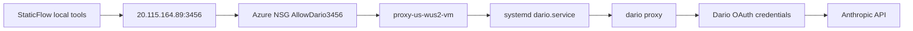

# Dario Azure Proxy 部署与运行手册

## 1. 当前服务事实

当前 Dario 代理服务是 StaticFlow 之外的独立 Azure VM 服务，用于把本机或其他客户端的 Anthropic Messages API 请求转发到 Dario 登录态。它不是当前 AWS `llm-access` 生产网关的一部分，不能默认替代 `/v1/*`、`/cc/v1/*`、`/api/llm-gateway/*` 等线上路径。

| 项目 | 当前值 |
| --- | --- |
| 公开 base URL | `http://20.115.164.89:3456` |
| 健康检查 | `GET http://20.115.164.89:3456/health` |
| 认证头 | `Authorization: Bearer <DARIO_API_KEY>` |
| Azure subscription | `8c379ee9-ce6b-485c-a16d-d02dda39df42` |
| Azure resource group | `proxy-us-wus2-rg` |
| Azure VM | `proxy-us-wus2-vm` |
| Azure public IP | `20.115.164.89` |
| Azure private IP | `10.0.0.4` |
| Azure NSG | `proxy-us-wus2-vmNSG` |
| NSG inbound rule | `AllowDario3456`, TCP `3456`, source `Internet`, allow |
| Remote Linux user | `azureuser` |
| Remote systemd unit | `/etc/systemd/system/dario.service` |
| Remote env file | `/home/azureuser/.dario/dario.env` |
| Remote Dario binary | `/home/azureuser/.nvm/versions/node/v24.18.0/bin/dario` |
| Remote Dario package | `@askalf/dario@4.8.146` |
| Remote Node/npm | `node v24.18.0`, `npm 11.18.0` |
| Remote Bun | `/home/azureuser/.bun/bin/bun`, `1.3.14` |
| 本地 Dario 源码路径 | `/home/ts_user/llm_pro/dario` |
| 本地 Dario 源码 remote | `https://github.com/askalf/dario.git` |

`DARIO_API_KEY` 已配置在远端 `/home/azureuser/.dario/dario.env`。不要把明文 key 提交到 StaticFlow 的 tracked 文档或脚本里；从本机验证时用 shell 变量传入：

```bash
export DARIO_BASE_URL=http://20.115.164.89:3456
export DARIO_API_KEY='<DARIO_API_KEY>'
```

## 2. 请求路径



远端进程绑定 `0.0.0.0:3456`，所以公网访问控制目前依赖 Azure NSG 规则和 `DARIO_API_KEY`。`/health` 按 Dario 设计不要求认证；模型和消息端点必须要求 bearer key。

## 3. 远端安装历史

这台 Azure VM 最初使用 Ubuntu 包管理器里的 `/usr/bin/node v12.22.9`，npm 全局安装路径归 root 所有，所以 `npm -g` 会要求 `sudo`，Dario 也可能通过不兼容的旧 Node 路径启动。

修正后的部署使用 `nvm` 管理的用户级 Node 工具链：

```bash
ssh azureuser@20.115.164.89

# Node and npm are owned by azureuser through nvm.
export NVM_DIR="$HOME/.nvm"
. "$NVM_DIR/nvm.sh"
nvm install --lts
nvm alias default node
nvm use default

npm install -g npm@latest
npm install -g @askalf/dario@latest

# Bun is installed under azureuser as well.
curl -fsSL https://bun.sh/install | bash
```

必要的 PATH 入口已经持久化到 `/home/azureuser/.bashrc`：

```bash
export NVM_DIR="$HOME/.nvm"
[ -s "$NVM_DIR/nvm.sh" ] && \. "$NVM_DIR/nvm.sh"
[ -s "$NVM_DIR/bash_completion" ] && \. "$NVM_DIR/bash_completion"
export BUN_INSTALL="$HOME/.bun"
export PATH="$BUN_INSTALL/bin:$PATH"
```

避免在这台主机上使用 `/usr/local/bin/dario`。该路径仍可能解析到旧的全局安装，并在系统 Node 12 下失败。因此 systemd 使用 nvm 管理的绝对二进制路径。

## 4. systemd 部署

远端 env 文件：

```bash
sudo install -d -o azureuser -g azureuser -m 700 /home/azureuser/.dario
sudo install -o azureuser -g azureuser -m 600 /dev/null /home/azureuser/.dario/dario.env
sudoedit /home/azureuser/.dario/dario.env
```

期望 env 结构：

```bash
DARIO_HOST=0.0.0.0
DARIO_PORT=3456
DARIO_API_KEY=<remote bearer key>
DARIO_LOG_FILE=/home/azureuser/.dario/dario.jsonl
PATH=/home/azureuser/.bun/bin:/home/azureuser/.nvm/versions/node/v24.18.0/bin:/usr/local/sbin:/usr/local/bin:/usr/sbin:/usr/bin:/sbin:/bin
HOME=/home/azureuser
```

systemd unit 结构：

```ini
[Unit]
Description=Dario Anthropic proxy
After=network-online.target
Wants=network-online.target

[Service]
Type=simple
User=azureuser
WorkingDirectory=/home/azureuser
EnvironmentFile=/home/azureuser/.dario/dario.env
ExecStart=/home/azureuser/.nvm/versions/node/v24.18.0/bin/dario proxy --host=0.0.0.0 --port=3456
Restart=always
RestartSec=5

[Install]
WantedBy=multi-user.target
```

启用命令：

```bash
sudo systemctl daemon-reload
sudo systemctl enable --now dario.service
sudo systemctl status dario.service --no-pager
```

VM 上的运行状态检查：

```bash
systemctl is-enabled dario.service
systemctl is-active dario.service
sudo ss -ltnp 'sport = :3456'
sudo journalctl -u dario.service -n 80 --no-pager
```

## 5. Azure 端口开放

Dario 端口目前按要求在 NSG 层面对全网开放。登录对应 Azure subscription 后，用 Azure CLI 验证或重建规则：

```bash
az account set --subscription 8c379ee9-ce6b-485c-a16d-d02dda39df42

az network nsg rule show \
  --resource-group proxy-us-wus2-rg \
  --nsg-name proxy-us-wus2-vmNSG \
  --name AllowDario3456 \
  --query '{name:name, access:access, direction:direction, priority:priority, source:sourceAddressPrefix, port:destinationPortRange}'

az network nsg rule create \
  --resource-group proxy-us-wus2-rg \
  --nsg-name proxy-us-wus2-vmNSG \
  --name AllowDario3456 \
  --priority 1030 \
  --direction Inbound \
  --access Allow \
  --protocol Tcp \
  --source-address-prefixes Internet \
  --destination-port-ranges 3456
```

不要再通过移除 Dario bearer 认证继续放松访问控制。端口已经是公网开放。

## 6. 本机验证

这台工作站经常带有 `HTTP_PROXY=http://127.0.0.1:11111` 这类本地代理变量。直接验证 Azure 公网服务时，显式绕过这些变量：

```bash
export DARIO_BASE_URL=http://20.115.164.89:3456
export DARIO_API_KEY='<DARIO_API_KEY>'

curl --noproxy '*' -sS "$DARIO_BASE_URL/health"

curl --noproxy '*' -sS -o /dev/null -w '%{http_code}\n' \
  "$DARIO_BASE_URL/v1/models"

curl --noproxy '*' -sS -H "Authorization: Bearer $DARIO_API_KEY" \
  "$DARIO_BASE_URL/v1/models"
```

期望结果：

- 代理和登录态可用时，`/health` 返回 HTTP 200 和 `{"status":"ok"}`。
- 无认证请求 `/v1/models` 返回 HTTP 401。
- 带认证请求 `/v1/models` 返回 HTTP 200 和 OpenAI-style `data` 数组。

代表性消息验证：

```bash
curl --noproxy '*' -sS \
  -H "Authorization: Bearer $DARIO_API_KEY" \
  -H 'Content-Type: application/json' \
  "$DARIO_BASE_URL/v1/messages" \
  -d '{
    "model": "claude-fable-5",
    "max_tokens": 512,
    "messages": [
      {
        "role": "user",
        "content": "Solve over the reals: x^4 - 5x^2 + 4 = 0. Return only the roots."
      }
    ]
  }'
```

当前部署的已观察成功结果：Dario 返回 HTTP 200，响应模型为 `claude-fable-5`，答案包含实根 `x = -2, -1, 1, 2`。

自动化里使用完整模型 ID。`haiku` 这类短名不一定被每种 endpoint shape 接受；`claude-haiku-4-5-20251001` 已验证可用。

## 7. 已观察模型目录

当前 `/v1/models` 响应列出过以下模型 ID：

- `claude-fable-5`
- `claude-fable-5[1m]`
- `claude-opus-4-8`
- `claude-opus-4-8[1m]`
- `claude-opus-4-7`
- `claude-opus-4-7[1m]`
- `claude-opus-4-6`
- `claude-opus-4-6[1m]`
- `claude-opus-4-5-20251101`
- `claude-opus-4-5-20251101[1m]`
- `claude-opus-4-1-20250805`
- `claude-opus-4-1-20250805[1m]`
- `claude-sonnet-5`
- `claude-sonnet-5[1m]`
- `claude-sonnet-4-6`
- `claude-sonnet-4-6[1m]`
- `claude-sonnet-4-5-20250929`
- `claude-sonnet-4-5-20250929[1m]`
- `claude-haiku-4-5-20251001`

把这份列表当作运行时观察结果，不要当作硬编码契约。接入模型路由前应重新请求 `/v1/models`。

## 8. 运行维护

修改 env 后重启代理：

```bash
ssh azureuser@20.115.164.89
sudo systemctl restart dario.service
sudo systemctl status dario.service --no-pager
```

轮换 API key：

```bash
ssh azureuser@20.115.164.89
sudoedit /home/azureuser/.dario/dario.env
sudo systemctl restart dario.service

export DARIO_BASE_URL=http://20.115.164.89:3456
export DARIO_API_KEY='<new key>'
curl --noproxy '*' -sS -H "Authorization: Bearer $DARIO_API_KEY" \
  "$DARIO_BASE_URL/v1/models" >/dev/null
```

更新 Dario：

```bash
ssh azureuser@20.115.164.89
export NVM_DIR="$HOME/.nvm"
. "$NVM_DIR/nvm.sh"
npm install -g @askalf/dario@latest
dario --version
sudo systemctl restart dario.service
```

查看日志：

```bash
ssh azureuser@20.115.164.89
sudo journalctl -u dario.service -f
tail -f /home/azureuser/.dario/dario.jsonl
```

当前服务曾输出以下警告：

```text
No Claude Code device identity found. Requests may be billed as Extra Usage. Run Claude Code at least once to generate ~/.claude/.claude.json
```

如果计费行为重要，不要忽略这个警告。功能 smoke test 在验证时仍返回过 `five_hour` 代表性 claim，但该警告意味着后续登录态变化后应重新检查账号和设备状态。

## 9. 故障模式

- 公网 TCP 访问依赖 Azure NSG。如果 `curl --noproxy '*' http://20.115.164.89:3456/health` 超时，检查 NSG 规则 `AllowDario3456`、VM 状态和 `ss -ltnp 'sport = :3456'`。
- `/v1/models` 或 `/v1/messages` 的认证失败通常表示调用方缺少 `Authorization: Bearer <DARIO_API_KEY>`，或者 `/home/azureuser/.dario/dario.env` 里的 key 已变化。
- OAuth 降级会体现在 `/health`、Dario 日志或上游 401/403/429 响应里。凭据过期或被撤销时，在 VM 上重新执行 Dario login 流程。
- 当前部署是公网 IP 上的明文 HTTP。面向浏览器或多人使用前，先加 TLS 和更严格的入口控制，再把它当作生产级服务。
- 没有明确设计变更时，不要把 StaticFlow 生产 LLM 路径切到该代理。当前生产 LLM 访问仍是 `AGENTS.md` 和 `docs/ops-runbook.md` 中记录的 AWS `llm-access` 服务。

## 10. Dario 源码索引

本地源码 checkout：`/home/ts_user/llm_pro/dario`。

- `src/cli.ts`: CLI 命令入口，包括 `dario proxy`、login、resume 和运维命令。
- `src/proxy.ts`: HTTP 服务主体，负责 `/health`、`/status`、`/v1/models`、`/v1/messages`、认证闸门、账号池、日志和 admin route 挂载。
- `src/admin-api.ts`: 可选的 headless `/admin/*` 控制面，负责账号登录和账号池管理。
- `src/model-catalog.ts`: 模型目录发现和 OpenAI-style `/v1/models` 响应构造。
- `src/tui/proxy-client.ts`: 终端 UI 客户端，负责状态、模型目录和 admin/resume 动作。
- `docs/commands.md`: Dario 命令和 endpoint 参考。
- `docs/admin-api.md`: Dario headless admin API 参考。
- `docs/docker.md`: 容器和 Kubernetes 部署参考。
